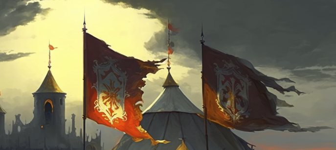

# Capture the Flag

Experience team-based PvP in New Dawn's classic Capture the Flag system. Coordinate with your team in 10v10 battles to capture the enemy flag while defending your own in fast-paced 20-minute matches.

!!! info
    This mode is heavily influenced by WoW's Warsong Gulch.

## Overview

Capture the Flag (CTF) brings structured, team-based PvP to New Dawn with rules inspired by classic games like World of Warcraft's Warsong Gulch. Players compete in organized matches with clear objectives, earning points for their performance and contributing to their team's victory.

## How to Join

### Sign-Up Process

1. When a CTF match is starting, type `[ctf` to join
2. **Sign-up period:** 5 minutes before the match begins
3. You'll be assigned to a team (Red or Blue)
4. Can join team-specific or random team matches

### Schedule

- CTF runs on an automated schedule
- Currently starts 5 minutes after the previous match ends (testing schedule)
- System announces when sign-ups are open
- Regular messages during sign-up period show time remaining

### Requirements

- No minimum skill requirements
- Cannot be carrying a pirate map
- Cannot use `[stuck` with the CTF flag
- Summoning spells are blocked during matches

!!! warning "Match Start Requirements"
    A game will only start if both teams have at least 1 player. Empty team = no match.

## Game Rules

### Objective

Capture the enemy's flag and return it to your base **3 times** to win, or have the most captures after 20 minutes.

### Win Conditions

1. **First team to 3 captures** wins immediately
2. **After 20 minutes:** Team with most captures wins
3. **If tied on captures:** Team with most points wins
4. **If tied on points:** Draw (rare)

### Flag Mechanics

**Picking Up the Flag:**

- Touch the enemy flag at their base to pick it up
- Cannot hide while carrying the flag
- Cannot use stealth while carrying the flag
- Flag carrier has **120 seconds** to capture before they're killed

**Dropping the Flag:**

- Flag drops when carrier is killed
- Flag carrier can manually drop by using flag on themselves (5-second pickup penalty)
- Dropped flags return automatically after **5 seconds** unless picked up

**Capturing the Flag:**

- Must bring enemy flag to your base
- **Your flag must be at your base** to score
- If both flags are being carried, neither team can score
- After capture: **20-second delay** before flags can be grabbed again

## The Maps

### Map 1: Pirate Treasure Island

- Island-themed battleground
- Multiple pathways between bases
- Environmental obstacles
- Water hazards

### Map 2: Old Trinsic

- Ruined town setting
- Urban combat environment
- Buildings and structures for cover
- Multiple routes and flanking opportunities

## Match Mechanics

### Respawning

- Die and resurrect automatically at your team's spawn point
- **10-second respawn timer**
- All equipment returns to your backpack
- Death robe is automatically removed
- No resource loss (potions, reagents, etc. are restored)

### Combat Rules

- Full PvP enabled between teams
- Stealing skill is disabled
- Summoning spells are blocked
- No skill gains during matches
- Killing yourself awards no points

## Scoring System

### Team Points

Teams earn points for objectives and kills:

- **5 points:** Capturing the flag
- **4 points:** Returning your flag to base
- **3 points:** Stealing the enemy flag
- **2 points:** Killing the enemy flag carrier
- **1 point:** Killing a player

### Individual Stats

Your performance is tracked throughout the match:

- **Total Points:** Individual contribution
- **Total Damage:** Damage dealt to enemies
- **Flags Captured:** Number of successful captures
- **Flags Returned:** Times you returned your flag
- **Flags Stolen:** Times you grabbed the enemy flag
- **Flag Carriers Killed:** Enemy carriers defeated
- **Players Killed:** Total kills
- **Deaths:** Times you died
- **Base Defense Deaths:** Deaths near your base

All stats are displayed on the scoreboard and recorded at match end.

## Strategy & Tips

### Roles

**Flag Carrier:**

- High mobility builds (mounted if allowed)
- Defensive skills and gear
- Communication - call for escorts
- Know when to drop flag tactically

**Escort:**

- Protect your flag carrier
- Clear path ahead
- Heal and support
- Intercept pursuers

**Defender:**

- Guard your base
- Intercept enemy carriers
- Return dropped flags quickly
- Communication crucial

**Attacker:**

- Pressure enemy base
- Kill enemy carrier
- Steal their flag
- Work with your carrier

### General Tips

- **Coordinate:** Success requires teamwork
- **Communicate:** Call out enemy positions and flag status
- **Balance:** Don't everyone go offense or defense
- **Timing:** Wait for your team before major pushes
- **Awareness:** Watch the scoreboard and time remaining
- **Adapt:** Adjust strategy based on score and time

## Rewards

Currently, CTF is primarily for competitive PvP enjoyment and stat tracking. Future updates may include:

- Leaderboards
- Seasonal rewards
- Special titles
- Unique items

## Common Questions

**Q: Do I lose items if I die?**
A: No. All your equipment returns to your backpack when you respawn.

**Q: Are resources consumed?**
A: No. Potions, reagents, and other consumables are restored.

**Q: Can I use summons?**
A: No. Summoning spells are blocked in CTF.

**Q: Can I hide with the flag?**
A: No. Carrying the flag prevents hiding and stealth.

**Q: What if I get disconnected?**
A: You'll be removed from the match. Your team continues with fewer players.

**Q: Can I join multiple accounts?**
A: No. Multi-client restrictions apply to CTF.

## Patch History

Capture the Flag was introduced in **Patch 0.26** with extensive refinements:

- **0.26:** Initial CTF system with two maps and automated scheduling
- **0.27:** Scoreboard updates, signup messages, wait time reduced to 5 minutes
- **0.27:** Hide restrictions with flag, flag return fixes, boat placement blocked
- **0.27:** Suicide points removed
- **0.29:** Item consumption bugs fixed
- **0.29:** Summoning spells blocked
- **0.30:** Auto-hide with flag fixed, summoning actually blocked
- **0.31:** Player signup cap at 10, no skill gains

For detailed changes, see the [patch notes](../patches/index.md).

## Related Systems

- [PvP & Murder System](../game-mechanics/pvp/index.md) - Learn about New Dawn's PvP mechanics
- [Combat System](../game-mechanics/combat.md) - Combat mechanics that apply in CTF
- [Achievements](achievements.md) - CTF-related achievements
