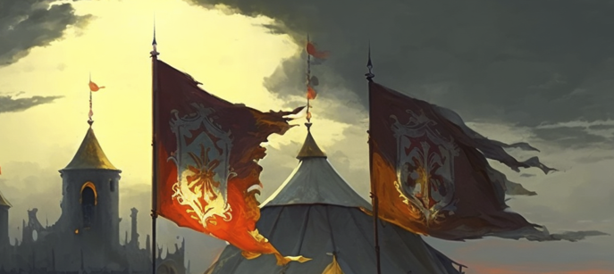

# Capture the Flag

Capture the Flag (CTF) is New Dawn's team-based PvP mode. Two teams of pirates race to steal the enemy flag and bring it back to their base, while defending their own flag from being taken.

## Overview

The CTF system is inspired by classic team-based flag games like Warsong Gulch. Matches are held on dedicated pirate-themed arenas, with two rival crews — the **Scallywags** and the **Scoundrels** — fighting it out for glory and War Tokens.

## How to Join

Head to **Dawn (Event Center)** and find the CTF signup book. Use it to register your interest for an available arena. You'll be assigned to a team automatically when you sign up.

### Queue System

CTF runs on a demand-driven queue rather than a fixed schedule:

1. The automated queue timer **opens signups** for an arena.
2. Once the **minimum number of players per team** have signed up, a **1-minute fill window** opens — extra players can still join.
3. After the fill window, all queued players receive a **confirmation gump** to accept entry and teleport into the arena.
4. Players who don't confirm in time are removed. If either team is left empty after confirmations, the match is cancelled.
5. The game then has a **1-minute prep period** before combat begins and players are unlocked.

!!! note
    You cannot join CTF while queued for a duel. Multi-accounting is blocked — if another character tied to your Discord account is already in a match, you will be denied entry.

## The Arenas

Both arenas are pirate-themed and located in Felucca. **Mounts are not allowed** in either arena. After each flag capture, **all living players are returned to their team's starting location**.

### Pirate Treasure Island

> _The Battle for Treasure Island_

- Minimum **3 players per team** to start
- Maximum **10 players per team**
- Island-themed battleground with multiple pathways between bases

### Pirate Shipwreck Arena

> _The Battle for Survival_

- Minimum **5 players per team** to start
- Maximum **10 players per team**
- Shipwreck-themed map with long bridge battles

## Teams

Both arenas use the same two teams:

| Team           | Colo r |
| -------------- | ------ |
| **Scallywags** | Blue   |
| **Scoundrels** | Red    |

Your character will be tinted with your team's color for the duration of the match, so you can always tell friend from foe at a glance. Flag carriers are highlighted in a distinct gold hue while they carry the flag.

## Objective & Win Conditions

The first team to **capture the enemy flag 3 times** wins immediately. If neither team hits 3 captures before the **20-minute time limit**, the match ends and the following tiebreakers apply in order:

1. **Most flag captures** — team with more wins
2. **Most total points** — if captures are tied, points decide
3. **Draw** — if both captures and points are equal (extremely rare)

## Flag Mechanics

### Picking Up the Flag

Double-click the enemy flag at their base to steal it. The flag will be placed in your backpack.

- You **cannot hide or stealth** while carrying the flag
- You have a **carry-time countdown** before being forced to capture or be killed:
  - **First pickup:** 120 seconds
  - Each subsequent relay pickup (picking up a flag that was already stolen and dropped) reduces the timer by 30 seconds, down to a minimum of 15 seconds
- Countdown warnings are sent at 60, 30, 15, 10, 5, 4, 3, 2, and 1 seconds remaining
- If the timer hits zero, you are **killed** and the flag is returned home automatically

### Dropping the Flag

You can manually drop the flag by using it on yourself. After dropping:

- You cannot pick it back up for **5 seconds**
- Your remaining carry time is clamped to at most 5 seconds — you can't drop-and-pickup to reset the clock

If you are **killed** while carrying the flag, it drops at your location. Any player (enemy or ally) can pick it up from the ground.

### Capturing the Flag

To score a capture:

1. Steal the enemy flag and bring it to **your own flag base**
2. Double-click the flag from your backpack and target your **own flag base**
3. Your flag **must be resting at your home base** to score — if your flag has been stolen, you cannot capture

After a successful capture:

- Both flags are reset to their home bases
- A **20-second lock** prevents either flag from being picked up (with countdown announcements)
- All living players are **returned to their team's starting positions**

### Returning Your Flag

If the enemy has stolen your flag, walk up to it (wherever it has been dropped or left on the ground) and double-click it to return it home. You earn **4 points** for a return, subject to a 60-second cooldown to prevent farming.

---

## Combat Rules

- Full PvP is enabled between opposing teams — friendly fire is not
- No mounts allowed
- No pets or followers may enter the arena
- Stealing skill is disabled
- Summoning spells are blocked
- Skill and stat gains do not occur during matches
- Potions, reagents, and other consumables are **free** — nothing is consumed inside the arena
- Killing yourself awards no points

---

## Scoring System

Points are awarded to individual players throughout the match. Team victory is determined by captures, but individual points feed into War Token rewards and tiebreakers.

| Action                                                                 | Points                  |
| ---------------------------------------------------------------------- | ----------------------- |
| Capturing the enemy flag                                               | **+5**                  |
| Returning your flag to base                                            | **+4** _(60s cooldown)_ |
| Killing the enemy flag carrier                                         | **+4**                  |
| Base Raid — killing an enemy inside their own base                     | **+3**                  |
| Defending — dying while actively fighting to protect your flag carrier | **+2**                  |
| Defending (proximity) — dying near your flag carrier                   | **+1**                  |
| Elimination — killing any enemy player                                 | **+1**                  |

!!! note
    Flag **steals** are tracked as a stat but award no direct points on their own — the points come when you successfully capture.

### Anti-Exploit Protections

Several measures are in place to prevent point farming:

- **Death-point cooldown:** Defend/proximity death points have a 30-second cooldown per death to prevent death-farming loops
- **Return cooldown:** Flag return points have a 60-second cooldown per player
- **Drop clamping:** Dropping and re-picking the flag cannot reset your carry-time upward
- **Base Raid guard:** The guarding bonus goes to the killer, not the victim, so deliberately dying near the base earns nothing

---

## Death & Respawning

When you die in CTF:

1. Your corpse is looted back into your backpack automatically — **you never lose items**
2. You are shown the scoreboard
3. After a **10-second delay**, you are resurrected and teleported back to your team's starting location fully healed
4. All buffs, debuffs, and active spells are cleared on respawn
5. The death robe is automatically removed

---

## War Tokens

War Tokens are the currency earned through CTF matches. At the end of a game, tokens are awarded based on your **individual points** for that match:

- **Winners** receive their total points plus a **+5 win bonus**
- **Losers** receive their total points only
- There is a **daily cap of 150 War Tokens** per player — once hit, stats still record but no further tokens are awarded until the next day (Central Time)

Check your balance at any time with the `[CTFWarTokens` command.

### Reward Store

Spend War Tokens at the **Commander's War Chest** vendor in Dawn.

## Individual Stats Tracked

Your performance is recorded every match and visible on the scoreboard:

- Total Points
- Flags Captured
- Flags Returned
- Flags Stolen
- Flag Carriers Killed
- Base Raids
- Players Killed (Eliminations)
- Deaths
- Total Damage Dealt

## Strategy & Tips

### Role Suggestions

| Role            | Focus                                                                        |
| --------------- | ---------------------------------------------------------------------------- |
| **Flag Runner** | Grab the flag and move fast — call for escorts, know when to drop tactically |
| **Escort**      | Protect your carrier, intercept pursuers, stay close                         |
| **Defender**    | Guard your base and return your flag quickly when stolen                     |
| **Raider**      | Pressure the enemy base, kill their carrier, earn Base Raid bonuses          |

### General Tips

- **Balance your team** — don't send everyone on offense at once
- **Carry time is limited** — coordinate handoffs, but remember each relay cuts the timer
- **Your flag must be home to score** — prioritize returning your flag when it's stolen before pushing for a capture
- **Base Raids are worth 3 points** — killing enemies inside their own base is often more rewarding than a mid-field fight
- **Watch the scoreboard** — it tells you captures, points, and time remaining

## Common Questions

**Q: Do I lose items if I die?**

A: No. All equipment is returned to your backpack when you respawn.

**Q: Are consumables used up?**

A: No. Potions, reagents, and other consumables are free inside the arena.

**Q: Can I use summons or pets?**

A: No. Summoning spells are blocked and pets cannot enter the arena.

**Q: Can I hide or stealth with the flag?**

A: No. Carrying the flag prevents all forms of hiding and stealth.

**Q: What happens if I get disconnected?**

A: You are removed from the match. Any flag you were carrying is dropped and the team continues without you.

**Q: Can I join with multiple accounts?**

A: No. The system checks your linked Discord account and will block entry if another character is already queued or active in a match.

**Q: What's the daily War Token cap?**

A: 150 tokens per day (Central Time). Your stats are still recorded after the cap, but no additional tokens are awarded until the next day.
