# Housing

General information about houses.

You can have 1 house per account (total 3 houses).

## Placement tool

## Index

=== "Classic Houses"

    |                                                       House                                                        | Size  | Secures | Lockdowns |   Cost    |
    |:------------------------------------------------------------------------------------------------------------------:|:-----:|:-------:|:---------:|:---------:|
    |            Stone and plaster house           |  8x8  |    1    |    30     |  43,800   |
    |                 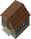 Field stone house                 |  8x8  |    1    |    30     |  43,800   |
    |                 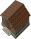 Small brick house                 |  8x8  |    1    |    30     |  43,800   |
    |                      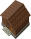 Wooden house                      |  8x8  |    1    |    30     |  43,800   |
    |             Wood and plaster house            |  8x8  |    1    |    30     |  43,800   |
    |             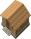 Thatched-roof cottage             |  8x8  |    1    |    30     |  43,800   |
    |              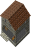 Small stone workshop              |  8x8  |    1    |    62     |  60,600   |
    |             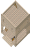 Small marble workshop             |  8x8  |    1    |    62     |  60,600   |
    |                 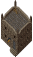 Small stone tower                 |  8x8  |    3    |    110    |  88,500   |
    |                   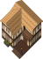 Two-story villa                   | 12x12 |    4    |    135    |  136,500  |
    |        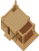 Sandstone house with patio        | 12x10 |    4    |    135    |  300,000  |
    |               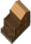 Two-story log cabin               | 8x14  |    4    |    135    |  109,500  |
    |                       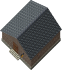 Brick house                       | 15x15 |    6    |    195    |  208,500  |
    |   Two-story wood and plaster house  | 15x15 |    6    |    195    |  278,500  |
    |  Two-story stone and plaster house | 15x15 |    6    |    195    |  278,500  |
    |            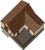 Large house with patio            | 16x15 |    6    |    195    |  152,800  |
    |                             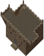 Tower                             | 24x16 |   12    |    370    |  433,200  |
    |                  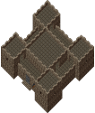 Small stone keep                  | 24x24 |   21    |    500    |  798,000  |
    |                            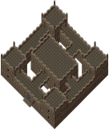 Castle                            | 31x32 |   30    |    800    | 1,022,800 |

=== "Updated Classic"

    |                                                                House                                                                 | Size  | Secures | Lockdowns |  Cost   |
    |:------------------------------------------------------------------------------------------------------------------------------------:|:-----:|:-------:|:---------:|:-------:|
    |                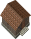 Small brick house (East)                |  8x8  |    1    |    30     | 43,800  |
    |           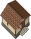 Wood and plaster house (East)           |  8x8  |    1    |    30     | 43,800  |
    |           Stone and plaster house (East)          |  8x8  |    1    |    30     | 43,800  |
    |                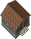 Field stone house (East)                |  8x8  |    1    |    30     | 43,800  |
    |            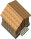 Thatched-roof cottage (East)            |  8x8  |    1    |    30     | 43,800  |
    |                     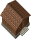 Wooden house (East)                     |  8x8  |    1    |    30     | 43,800  |
    |                       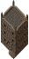 Tall small tower                       |  8x8  |    5    |    130    | 125,000 |
    |                       Three story villa                      | 12x12 |    6    |    195    | 262,000 |
    |                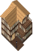 Three story villa (East)                | 12x12 |    6    |    195    | 262,000 |
    |                  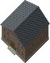 Two-story brick house                  | 15x15 |   10    |    295    | 300,500 |
    |       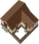 Large house with courtyard patio       | 16x15 |    9    |    285    | 670,000 |
    | 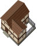 Two-story wood/plaster courtyard patio | 15x15 |    9    |    285    | 650,000 |
    |    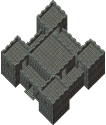 Large gray keep with rear courtyard    | 24x24 |   21    |    500    | 798,000 |
    |            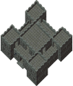 Large gray keep with corner            | 24x24 |   21    |    500    | 798,000 |

=== "Custom Houses"

    |                                                      House                                                      | Size  | Secures | Lockdowns |   Cost    |
    |:---------------------------------------------------------------------------------------------------------------:|:-----:|:-------:|:---------:|:---------:|
    |            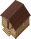 Small Rough Sandstone            |  8x8  |    1    |    30     |  52,000   |
    |      Small Wood and Plaster Villa     |  9x9  |    3    |    110    |  90,000   |
    |           Small Field Brick Villa          |  9x9  |    2    |    62     |  90,000   |
    |          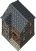 Small Field Stone Villa          |  9x9  |    2    |    62     |  90,000   |
    |                  Small Wood Villa                 |  9x9  |    2    |    62     |  90,000   |
    |  Medium T‑Shaped Wood and Plaster | 14x11 |    2    |    62     |  110,000  |
    |           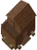 Two Story Wooden (East)           | 9x12  |    4    |    135    |  165,000  |
    |            Two Story Stone Vendor           |  9x9  |    4    |    135    |  195,000  |
    |                  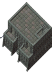 Yew Crypt Tower                  | 12x12 |    5    |    195    |  233,000  |
    |    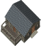 Medium Fieldstone Patio House    | 14x15 |    4    |    135    |  280,000  |
    |                 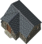 Field Stone Shop                 | 14x12 |    4    |    135    |  300,000  |
    |                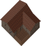 Brick Porch House                | 15x14 |    4    |    135    |  300,000  |
    |                   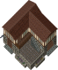 Merchant Villa                   | 16x15 |    9    |    285    |  322,500  |
    |         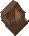 Medium Brick Patio House         | 16x14 |    4    |    135    |  330,000  |
    |             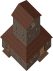 Square Steeple House             | 13x13 |    4    |    135    |  370,000  |
    |          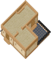 Sandstone Plaster Patio          | 17x18 |    8    |    225    |  360,000  |
    |            Two Story Square Brick           | 11x12 |    4    |    135    |  360,000  |
    |            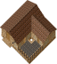 Large Sandstone Patio            | 16x15 |    9    |    250    |  385,000  |
    |      Two Story Wood Balcony House     | 14x10 |    6    |    195    |  420,000  |
    |                          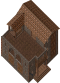 Mansion                          | 15x14 |    9    |    285    |  510,000  |
    |         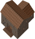 Two Story T‑Shaped Brick         | 14x17 |    6    |    195    |  520,000  |
    |          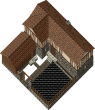 Wood Framed Stone Manor          | 23x22 |   15    |    390    |  650,000  |
    |             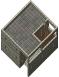 Large Stone Compound             | 13x14 |    9    |    285    |  680,000  |
    |      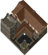 Wood Frame Manor with Tower      | 23x22 |   17    |    400    |  690,000  |
    | 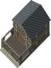 Two Story Fieldstone Patio House | 11x17 |    4    |    135    |  320,000  |
    | 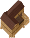 Sandstone Two Story with Balcony | 12x18 |    6    |    195    |  270,000  |
    |          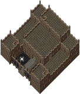 Large Castle with Fence          | 31x32 |   29    |    775    | 1,150,000 |
    |                 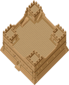 Sandstone Temple                 | 31x32 |   29    |    775    | 1,150,000 |

=== "Orc Houses"

    |                               House                                | Size  | Secures | Lockdowns |  Cost  |
    |:------------------------------------------------------------------:|:-----:|:-------:|:---------:|:------:|
    | 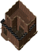 Orc Camp v1 | 12x12 |    2    |    25     | 35,000 |
    | 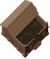 Orc Camp v2 | 14x14 |    2    |    25     | 35,000 |

## Classic houses

### Stone and plaster house

=== "Outside"

    { .on-glb }

=== "1st floor"

    { .on-glb }

### Field stone house

=== "Outside"

    { .on-glb }

=== "1st floor"

    { .on-glb }

### Small brick house

=== "Outside"

    { .on-glb }

=== "1st floor"

    { .on-glb }

### Wooden house

=== "Outside"

    { .on-glb }

=== "1st floor"

    { .on-glb }

### Wood and plaster house

=== "Outside"

    { .on-glb }

=== "1st floor"

    { .on-glb }

### Thatched-roof cottage

=== "Outside"

    { .on-glb }

=== "1st floor"

    { .on-glb }

### Small stone workshop

=== "Outside"

    { .on-glb }

=== "1st floor"

    { .on-glb }

=== "2nd floor"

    { .on-glb }

### Small marble workshop

=== "Outside"

    { .on-glb }

=== "1st floor"

    { .on-glb }

=== "2nd floor"

    { .on-glb }

### Small stone tower

=== "Outside"

    { .on-glb }

=== "1st floor"

    { .on-glb }

=== "2nd floor"

    { .on-glb }

### Two-story villa

=== "Outside"

    { .on-glb }

=== "1st floor"

    { .on-glb }

=== "2nd floor"

    { .on-glb }

### Sandstone house with patio

=== "Outside"

    { .on-glb }

=== "1st floor"

    { .on-glb }

### Two-story log cabin

=== "Outside"

    { .on-glb }

=== "1st floor"

    { .on-glb }

=== "2nd floor"

    { .on-glb }

### Brick house

=== "Outside"

    { .on-glb }

=== "1st floor"

    { .on-glb }

### Two-story wood and plaster house

=== "Outside"

    { .on-glb }

=== "1st floor"

    { .on-glb }

=== "2nd floor"

    { .on-glb }

### Two-story stone and plaster house

=== "Outside"

    { .on-glb }

=== "1st floor"

    { .on-glb }

=== "2nd floor"

    { .on-glb }

### Large house with patio

=== "Outside"

    { .on-glb }

=== "1st floor"

    { .on-glb }

### Tower

=== "Outside"

    { .on-glb }

=== "1st floor"

    { .on-glb }

=== "2nd floor"

    { .on-glb }

=== "3rd floor"

    { .on-glb }

### Small stone keep

=== "Outside"

    { .on-glb }

=== "1st floor"

    { .on-glb }

=== "2nd floor"

    { .on-glb }

### Castle

=== "Outside"

    { .on-glb }

=== "1st floor"

    { .on-glb }

=== "2nd floor"

    { .on-glb }

## Updated classic

### Small brick house (East)

=== "Outside"

    { .on-glb }

=== "1st floor"

    { .on-glb }

### Wood and plaster house (East)

=== "Outside"

    { .on-glb }

=== "1st floor"

    { .on-glb }

### Stone and plaster house (East)

=== "Outside"

    { .on-glb }

=== "1st floor"

    { .on-glb }

### Field stone house (East)

=== "Outside"

    { .on-glb }

=== "1st floor"

    { .on-glb }

### Thatched-roof cottage (East)

=== "Outside"

    { .on-glb }

=== "1st floor"

    { .on-glb }

### Wooden house (East)

=== "Outside"

    { .on-glb }

=== "1st floor"

    { .on-glb }

### Tall small tower

=== "Outside"

    { .on-glb }

=== "1st floor"

    { .on-glb }

=== "2nd floor"

    { .on-glb }

=== "3rd floor"

    { .on-glb }

### Three story villa

=== "Outside"

    { .on-glb }

=== "1st floor"

    { .on-glb }

=== "2nd floor"

    { .on-glb }

=== "3rd floor"

    { .on-glb }

### Three story villa (East)

=== "Outside"

    { .on-glb }

=== "1st floor"

    { .on-glb }

=== "2nd floor"

    { .on-glb }

=== "3rd floor"

    { .on-glb }

### Two-story brick house

=== "Outside"

    { .on-glb }

=== "1st floor"

    { .on-glb }

### Large house with courtyard patio

=== "Outside"

    { .on-glb }

=== "1st floor"

    { .on-glb }

### Two-story wood/plaster courtyard patio

=== "Outside"

    { .on-glb }

=== "1st floor"

    { .on-glb }

=== "2nd floor"

    { .on-glb }

### Large gray keep with rear courtyard

=== "Outside"

    { .on-glb }

=== "1st floor"

    { .on-glb }

=== "2nd floor"

    { .on-glb }

### Large gray keep with corner

=== "Outside"

    { .on-glb }

=== "1st floor"

    { .on-glb }

=== "2nd floor"

    { .on-glb }

## Custom houses

### Small Rough Sandstone

=== "Outside"

    { .on-glb }

=== "1st floor"

    { .on-glb }

### Small Wood and Plaster Villa

=== "Outside"

    { .on-glb }

=== "1st floor"

    { .on-glb }

=== "2nd floor"

    { .on-glb }

### Small Field Brick Villa

=== "Outside"

    { .on-glb }

=== "1st floor"

    { .on-glb }

=== "2nd floor"

    { .on-glb }

### Small Field Stone Villa

=== "Outside"

    { .on-glb }

=== "1st floor"

    { .on-glb }

=== "2nd floor"

    { .on-glb }

### Small Wood Villa

=== "Outside"

    { .on-glb }

=== "1st floor"

    { .on-glb }

=== "2nd floor"

    { .on-glb }

### Medium T‑Shaped Wood and Plaster

=== "Outside"

    { .on-glb }

=== "1st floor"

    { .on-glb }

### Two Story Wooden (East)

=== "Outside"

    { .on-glb }

=== "1st floor"

    { .on-glb }

=== "2nd floor"

    { .on-glb }

### Two Story Stone Vendor

=== "Outside"

    { .on-glb }

=== "1st floor"

    { .on-glb }

=== "2nd floor"

    { .on-glb }

### Yew Crypt Tower

=== "Outside"

    { .on-glb }

=== "1st floor"

    { .on-glb }

=== "2nd floor"

    { .on-glb }

### Medium Fieldstone Patio House

=== "Outside"

    { .on-glb }

=== "1st floor"

    { .on-glb }

### Field Stone Shop

=== "Outside"

    { .on-glb }

=== "1st floor"

    { .on-glb }

### Brick Porch House

=== "Outside"

    { .on-glb }

=== "1st floor"

    { .on-glb }

### Merchant Villa

=== "Outside"

    { .on-glb }

=== "1st floor"

    { .on-glb }

=== "2nd floor"

    { .on-glb }

### Medium Brick Patio House

=== "Outside"

    { .on-glb }

=== "1st floor"

    { .on-glb }

### Square Steeple House

=== "Outside"

    { .on-glb }

=== "1st floor"

    { .on-glb }

=== "2nd floor"

    { .on-glb }

=== "3rd floor"

    { .on-glb }

### Sandstone Plaster Patio

=== "Outside"

    { .on-glb }

=== "1st floor"

    { .on-glb }

### Two Story Square Brick

=== "Outside"

    { .on-glb }

=== "1st floor"

    { .on-glb }

=== "2nd floor"

    { .on-glb }

### Large Sandstone Patio

=== "Outside"

    { .on-glb }

=== "1st floor"

    { .on-glb }

### Two Story Wood Balcony House

=== "Outside"

    { .on-glb }

=== "1st floor"

    { .on-glb }

=== "2nd floor"

    { .on-glb }

### Mansion

=== "Outside"

    { .on-glb }

=== "1st floor"

    { .on-glb }

=== "2nd floor"

    { .on-glb }

=== "3rd floor"

    { .on-glb }

### Two Story T‑Shaped Brick

=== "Outside"

    { .on-glb }

=== "1st floor"

    { .on-glb }

=== "2nd floor"

    { .on-glb }

### Wood Framed Stone Manor

=== "Outside"

    { .on-glb }

=== "1st floor"

    { .on-glb }

=== "2nd floor"

    { .on-glb }

### Large Stone Compound

=== "Outside"

    { .on-glb }

=== "1st floor"

    { .on-glb }

=== "2nd floor"

    { .on-glb }

### Wood Frame Manor with Tower

=== "Outside"

    { .on-glb }

=== "1st floor"

    { .on-glb }

=== "2nd floor"

    { .on-glb }

### Two Story Fieldstone Patio House

=== "Outside"

    { .on-glb }

=== "1st floor"

    { .on-glb }

=== "2nd floor"

    { .on-glb }

### Sandstone Two Story with Balcony

=== "Outside"

    { .on-glb }

=== "1st floor"

    { .on-glb }

=== "2nd floor"

    { .on-glb }

### Large Castle with Fence

=== "Outside"

    { .on-glb }

=== "1st floor"

    { .on-glb }

=== "2nd floor"

    { .on-glb }

=== "3rd floor"

    { .on-glb }

### Sandstone Temple

=== "Outside"

    { .on-glb }

=== "1st floor"

    { .on-glb }

=== "2nd floor"

    { .on-glb }

=== "3rd floor"

    { .on-glb }

## Orc houses

### Orc camp v1

=== "Outside"

    { .on-glb }

=== "1st floor"

    { .on-glb }

### Orc camp v2

=== "Outside"

    { .on-glb }

=== "1st floor"

    { .on-glb }
