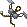
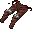
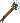
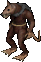
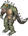
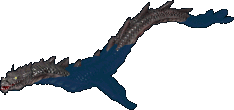
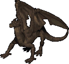
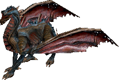

# Items & Equipment

This page is a technical reference for game items and equipment, providing detailed statistics on magical enchantments, slayer bonuses, armor ratings, weapon damage profiles etc.

## Magical properties

[Item Identification](../skills/utility-and-support/item-identification.md) allows you to reveal the magical properties of unidentified items.

### Armor enchantments

| Prefix         | Effect             |
|----------------|--------------------|
| Durable        | +5 to item Health  |
| Substantial    | +10 to item Health |
| Massive        | +15 to item Health |
| Fortified      | +20 to item Health |
| Indestructible | +25 to item Health |

The first number on this table shows the actual Armor Rating of the area it protects. It will not match the in-game character status window, which only displays the total average.

The numbers after the AR area shows the contribution to the total AR average, as showed in the character status window.

| Suffix          | AR of the area | Neck, Hands | Head, Arms, Legs/Feet | Body  |
|-----------------|----------------|-------------|-----------------------|-------|
| Defense         | +5             | +0.4        | +0.7                  | +2.2  |
| Guarding        | +10            | +0.7        | +1.4                  | +4.4  |
| Hardening       | +15            | +1.1        | +2.1                  | +6.6  |
| Fortification   | +20            | +1.4        | +2.8                  | +8.8  |
| Invulnerability | +25            | +1.8        | +3.5                  | +11.0 |

### Weapon enchantments

For Bows and Crossbows the bonus is applied to the Archery skill instead of Tactics.

| Prefix                | Effect                               |
|-----------------------|--------------------------------------|
| Accurate              | +5.0 to Tactics or +4.6 to Archery   |
| Surpassingly Accurate | +10.0 to Tactics or +9.3 to Archery  |
| Eminently Accurate    | +15.0 to Tactics or +14.0 to Archery |
| Exceedingly Accurate  | +20.0 to Tactics or +18.7 to Archery |
| Supremely Accurate    | +25.0 to Tactics or +23.3 to Archery |
| Durable               | +10 to item Health                   |
| Substantial           | +20 to item Health                   |
| Massive               | +30 to item Health                   |
| Fortified             | +40 to item Health                   |
| Indestructible        | +50 to item Health                   |

| Suffix      | Effect    |
|-------------|-----------|
| Ruin        | +1 damage |
| Might       | +3 damage |
| Force       | +5 damage |
| Power       | +7 damage |
| Vanquishing | +9 damage |

## Slayers

Slayers are magical bonuses on weapons and instruments that boost their power against specific enemy types. Weapons deal extra damage, while instruments gain higher success rates for bard abilities.

Using a slayer against a creature of the opposite type actually weakens your power, making it worse than using a normal weapon or instrument.

This list outlines every slayer and the specific monsters that take increased damage from that slayer.

### Humanoids

Opposite slayer type: Undead.

=== "Repond"

    ??? note "Click to expand"
        - Arctic Ogre Lord
        - Cyclopean Warrior
        - Evil Mage
        - Evil Mage Lord
        - Ettin
        - Frost Troll
        - Ogre
        - Ogre Lord
        - Orc
        - Orc Bomber
        - Orc Brute
        - Orc Captain
        - Orcish Lord
        - Ratman
        - Ratman Archer
        - Savage
        - Savage Rider
        - Titan

=== "Ogre Thrashing"

    ??? note "Click to expand"
        - Arctic Ogre Lord
        - Ogre
        - Ogre Lord

=== "Orc Slaying"

    ??? note "Click to expand"
        - Orc
        - Orc Bomber
        - Orc Brute
        - Orc Captain
        - Orcish Lord

=== "Troll Slaughter"

    ??? note "Click to expand"
        - Frost Troll
        - Troll

### Undead

Opposite slayer type: Humanoids.

=== "Silver"

    ??? note "Click to expand"
        - Ancient Lich
        - Bogle
        - Bone Knight
        - Bone Mage
        - Dark Guardian
        - Ghoul
        - Lich
        - Lich Lord
        - Mummy
        - Neira
        - Restless Soul
        - Revenant
        - Rotting Corpse
        - Shade
        - Skeletal Knight
        - Skeleton
        - Spectral Armour
        - Spectre
        - Wraith
        - Zombie

### Elemental

Opposite slayer type: Abyss.

=== "Elemental Ban"

    ??? note "Click to expand"
        - Acid Elemental
        - Agapite Elemental
        - Air Elemental
        - Blood Elemental
        - Bronze Elemental
        - Copper Elemental
        - Dull Copper Elemental
        - Efreet
        - Earth Elemental
        - Fire Elemental
        - Golden Elemental
        - Ice Elemental
        - Poison Elemental
        - Sand Vortex
        - Shadow Iron Elemental
        - Snow Elemental
        - Valorite Elemental
        - Verite Elemental
        - Water Elemental
        - Summoned Air Elemental
        - Summoned Earth Elemental
        - Summoned Fire Elemental
        - Summoned Water Elemental

=== "Blood Drinking"

    ??? note "Click to expand"
        - Blood Elemental

=== "Earth Shatter"

    ??? note "Click to expand"
        - Agapite Elemental
        - Bronze Elemental
        - Copper Elemental
        - Dull Copper Elemental
        - Earth Elemental
        - Golden Elemental
        - Shadow Iron Elemental
        - Valorite Elemental
        - Verite Elemental
        - Summoned Earth Elemental

=== "Elemental Health"

    ??? note "Click to expand"
        - Poison Elemental

=== "Flame Dousing"

    ??? note "Click to expand"
        - Fire Elemental
        - Summoned Fire Elemental

=== "Summer Wind"

    ??? note "Click to expand"
        - Ice Elemental
        - Snow Elemental

=== "Vacuum"

    ??? note "Click to expand"
        - Air Elemental
        - Summoned Air Elemental

=== "Water Dissipation"

    ??? note "Click to expand"
        - Water Elemental
        - Summoned Water Elemental

### Abyss

Opposite slayer type: Elemental.

=== "Exorcism"

    ??? note "Click to expand"
        - Arcane Daemon
        - Balron
        - Chaos Daemon
        - Daemon
        - Enslaved Gargoyle
        - Fire Gargoyle
        - Gargoyle
        - Gargoyle Destroyer
        - Gargoyle Enforcer
        - Horde Minion
        - Ice Fiend
        - Imp
        - Moloch
        - Semidar
        - Servant Of Semidar
        - Succubus

=== "Daemon Dismissal"

    ??? note "Click to expand"
        - Balron
        - Daemon
        - Ice Fiend
        - Imp
        - Semidar
        - Succubus
        - Summoned Daemon

=== "Gargoyle's Foe"

    ??? note "Click to expand"
        - Enslaved Gargoyle
        - Fire Gargoyle
        - Gargoyle
        - Gargoyle Destroyer
        - Gargoyle Enforcer
        - Stone Gargoyle

=== "Balron Damnation"

    ??? note "Click to expand"
        - Balron

### Arachnid

Opposite slayer type: Reptilian.

=== "Arachnid Doom"

    ??? note "Click to expand"
        - Dread Spider
        - Frost Spider
        - Giant Black Wide
        - Giant Spider
        - Mephitis
        - Scorpion
        - Terathan Avenger
        - Terathan Matriarch
        - Terathan Drone
        - Terathan Warrior

=== "Scorpion's Bane"

    ??? note "Click to expand"
        - Scorpion

=== "Spider's Death"

    ??? note "Click to expand"
        - Dread Spider
        - Frost Spider
        - Giant Black Wide
        - Giant Spider
        - Mephitis

=== "Terathan"

    ??? note "Click to expand"
        - Terathan Avenger
        - Terathan Matriarch
        - Terathan Drone
        - Terathan Warrior

### Reptilian

Opposite slayer type: Arachnid.

=== "Reptilian Death"

    ??? note "Click to expand"
        - Ancient Wyrm
        - Deep Sea Serpent
        - Dragon
        - Drake
        - Ophidian Apprentice Mage, An Ophidian Shaman
        - Ophidian Avenger, An Ophidian Knight-errant
        - Ophidian Enforcer, An Ophidian Warrior
        - Ophidian Justicar, An Ophidian Zealot
        - Ophidian Matriarch
        - Rikktor
        - Sea Serpent
        - Serado
        - Serpentine Dragon
        - Shadow Wyrm
        - Skeletal Dragon
        - White Wyrm
        - Wyvern

=== "Dragon Slaying"

    ??? note "Click to expand"
        - Ancient Wyrm
        - Dragon
        - Drake
        - Serpentine Dragon
        - Shadow Wyrm
        - Skeletal Dragon
        - White Wyrm
        - Wyvern

=== "Lizardman Slaughter"

    ??? note "Click to expand"
        - Lizardman

=== "Ophidian"

    ??? note "Click to expand"
        - Ophidian Apprentice Mage, An Ophidian Shaman
        - Ophidian Avenger, An Ophidian Knight-errant
        - Ophidian Enforcer, An Ophidian Warrior
        - Ophidian Justicar, An Ophidian Zealot
        - Ophidian Matriarch

=== "Snake's Bane"

    ??? note "Click to expand"
        - Deep Sea Serpent
        - Sea Serpent
        - Serado

### Fey

Opposite slayer type: Abyss.

=== "Fey"

    ??? note "Click to expand"
        - Centaur
        - Dark Wisp
        - Ethereal Warrior
        - Lord Oaks
        - Pixie
        - Shadow Wisp
        - Silvani
        - Wisp

## Armor

The AR Area on this table shows the actual Armor Rating of the area it protects. It will not match the in-game character status window, which only displays the total average.

The numbers after the AR Area shows the contribution to the total AR average, as showed in the character status window.

### Leather

Looted Leather armor can't be repaired.

|                                   Armor                                   | STR Req. |   Slot    | AR Area | AR Contr. | Item HP |
|:-------------------------------------------------------------------------:|:--------:|:---------:|:-------:|:---------:|:-------:|
|        Leather Gorget       |    10    |   Neck    |   13    |    0.9    | 31 - 37 |
|        Leather Gloves       |    10    |   Hands   |   13    |    0.9    | 31 - 37 |
|           Leather Cap          |    15    |   Head    |   13    |    1.8    | 31 - 37 |
|       Leather Sleeves      |    10    |   Arms    |   13    |    1.9    | 31 - 37 |
|       Leather Bustier      |    15    | Arms/Body |   13    |    1.9    | 31 - 37 |
|  Female Leather Armor |    15    | Arms/Body |   13    |    1.9    | 31 - 37 |
|      Leather Leggings     |    10    | Legs/Feet |   13    |    2.9    | 31 - 37 |
|        Leather Shorts       |    10    | Legs/Feet |   13    |    2.9    | 31 - 37 |
|         Leather Skirt        |    10    | Legs/Feet |   13    |    2.9    | 31 - 37 |
|         Leather Tunic        |    15    |   Body    |   13    |    4.7    | 31 - 37 |

### Studded

|                               Armor                                | STR Req. |   Slot    | AR Area | AR Contr. |  Item HP  |
|:------------------------------------------------------------------:|:--------:|:---------:|:-------:|:---------:|:---------:|
|    Studded Gorget    |    25    |   Neck    |   16    |    1.1    |  36 - 44  |
|    Studded Gloves    |    25    |   Hands   |   16    |    1.1    |  36 - 44  |
|   Studded Bustier   |    25    | Arms/Body |   16    |    2.4    | 101 - 115 |
|  Female Studded Armor |    35    | Arms/Body |   16    |    2.4    | 101 - 115 |
|   Studded Sleeves   |    25    |   Arms    |   16    |    2.4    |  36 - 44  |
|  Studded Leggings  |    35    | Legs/Feet |   16    |    3.5    |  36 - 44  |
|     Studded Tunic     |    35    |   Body    |   16    |    5.7    |  36 - 44  |

<!--
### Ranger

|            Armor             | STR Req. |   Slot    | AR Area | AR Contr. | Item HP |
|:----------------------------:|:--------:|:---------:|:-------:|:---------:|:-------:|
|  Ranger Armor Gloves (rare)  |    25    |   Hands   |   16    |    1.1    | 36 - 44 |
|  Ranger Armor Gorget (rare)  |    25    |   Neck    |   16    |    1.1    | 36 - 44 |
|   Ranger Armor Arms (rare)   |    25    |   Arms    |   16    |    2.4    | 36 - 44 |
| Ranger Armor Leggings (rare) |    35    | Legs/Feet |   16    |    3.5    | 36 - 44 |
|  Ranger Armor Tunic (rare)   |    35    |   Body    |   16    |    5.7    | 36 - 44 |
-->

### Ringmail

|                                Armor                                | STR Req. |   Slot    | AR Area | AR Contr. | Item HP |
|:-------------------------------------------------------------------:|:--------:|:---------:|:-------:|:---------:|:-------:|
|    Ringmail Gloves   |    20    |   Hands   |   22    |    1.5    | 41 - 51 |
|   Ringmail Sleeves  |    20    |   Arms    |   22    |    3.3    | 41 - 51 |
|  Ringmail Leggings |    20    | Legs/Feet |   22    |    4.8    | 41 - 51 |
|     Ringmail Tunic    |    20    |   Body    |   22    |    7.9    | 41 - 51 |

### Chainmail

|                                 Armor                                 | STR Req. |   Slot    | AR Area | AR Contr. | Item HP |
|:---------------------------------------------------------------------:|:--------:|:---------:|:-------:|:---------:|:-------:|
|      Chainmail Coif     |    20    |   Head    |   28    |    3.8    | 36 - 44 |
|  Chainmail Leggings |    20    | Legs/Feet |   28    |    6.2    | 46 - 58 |
|     Chainmail Tunic    |    20    |   Body    |   28    |   10.0    | 46 - 58 |

### Bone

Looted Bone armor can't be repaired.

|                            Armor                            | STR Req. |   Slot    | AR Area | AR Contr. | Item HP |
|:-----------------------------------------------------------:|:--------:|:---------:|:-------:|:---------:|:-------:|
|       Orc Helm      |    0     |   Head    |   20    |    2.7    | 31 - 70 |
|    Bone Gloves   |    40    |   Hands   |   30    |    2.1    | 26 - 30 |
|    Bone Helmet   |    40    |   Head    |   30    |    4.1    | 26 - 30 |
|      Bone Arms     |    40    |   Arms    |   30    |    4.4    | 26 - 30 |
|  Bone Leggings |    40    | Legs/Feet |   30    |    6.6    | 26 - 30 |
|     Bone Armor    |    40    |   Body    |   30    |   10.7    | 26 - 30 |

### Platemail

|                                    Armor                                    | STR Req. |   Slot    | AR Area | AR Contr. |  Item HP  |
|:---------------------------------------------------------------------------:|:--------:|:---------:|:-------:|:---------:|:---------:|
|               Bascinet              |    10    |   Head    |   18    |    2.4    | 101 - 115 |
|         Plate Gorget        |    30    |   Neck    |   40    |    2.8    |  51 - 65  |
|       Platemail Gloves      |    30    |   Hands   |   40    |    2.8    |  51 - 65  |
|            Close Helm           |    40    |   Head    |   30    |    4.1    |  46 - 58  |
|                 Helmet                |    40    |   Head    |   30    |    4.1    |  46 - 58  |
|             Norse Helm            |    40    |   Head    |   30    |    4.1    |  46 - 58  |
|  Plate Tunic (Female) |    45    | Arms/Body |   30    |    4.4    |  51 - 65  |
|             Plate Helm            |    40    |   Head    |   40    |    5.4    |  46 - 58  |
|         Platemail Arms        |    40    |   Arms    |   40    |    5.9    |  51 - 65  |
|         Platemail Legs        |    60    | Legs/Feet |   40    |    8.8    |  51 - 65  |
|        Platemail Tunic       |    60    |   Body    |   40    |   14.3    |  51 - 65  |

### Shields

This table shows the Armor Rating for each shield type.

Visit the [Parrying](../skills/combat/parrying.md) page for more information.

=== "Normal"

    |                         Shield Type                          | STR Required | AR  |  Item HP  |
    |:------------------------------------------------------------:|:------------:|:---:|:---------:|
    |     Buckler    |      15      |  7  |  41 - 51  |
    |      Wooden     |      5       |  8  |  21 - 23  |
    |      Bronze     |      20      | 10  |  26 - 30  |
    |       Metal      |      10      | 11  |  36 - 44  |
    |  Metal Kite |      30      | 16  | 101 - 115 |
    |      Heater     |      30      | 23  |  31 - 37  |
    |       Order      |      0       | 30  | 101 - 115 |
    |       Chaos      |      0       | 32  | 101 - 115 |

=== "GM Made"

    |                         Shield Type                          | STR Required | AR  |  Item HP  |
    |:------------------------------------------------------------:|:------------:|:---:|:---------:|
    |     Buckler    |      15      |  8  |  41 - 51  |
    |      Bronze     |      20      | 12  |  26 - 30  |
    |       Metal      |      10      | 13  |  36 - 44  |
    |  Metal Kite |      30      | 19  | 101 - 115 |
    |      Heater     |      30      | 27  |  31 - 37  |

=== "Defense"

    |                         Shield Type                          | STR Required | AR  |  Item HP  |
    |:------------------------------------------------------------:|:------------:|:---:|:---------:|
    |     Buckler    |      15      | 12  |  41 - 51  |
    |      Wooden     |      5       | 13  |  21 - 23  |
    |  Metal Kite |      30      | 21  | 101 - 115 |

=== "Guarding"

    |                         Shield Type                          | STR Required | AR  |  Item HP  |
    |:------------------------------------------------------------:|:------------:|:---:|:---------:|
    |     Buckler    |      15      | 17  |  41 - 51  |
    |      Wooden     |      5       | 18  |  21 - 23  |
    |  Metal Kite |      30      | 26  | 101 - 115 |

=== "Hardening"

    |                         Shield Type                          | STR Required | AR  |  Item HP  |
    |:------------------------------------------------------------:|:------------:|:---:|:---------:|
    |     Buckler    |      15      | 22  |  41 - 51  |
    |      Wooden     |      5       | 23  |  21 - 23  |
    |  Metal Kite |      30      | 31  | 101 - 115 |

=== "Fortification"

    |                         Shield Type                          | STR Required | AR  |  Item HP  |
    |:------------------------------------------------------------:|:------------:|:---:|:---------:|
    |     Buckler    |      15      | 27  |  41 - 51  |
    |      Wooden     |      5       | 28  |  21 - 23  |
    |  Metal Kite |      30      | 36  | 101 - 115 |

=== "Invulnerability"

    |                         Shield Type                          | STR Required | AR  |  Item HP  |
    |:------------------------------------------------------------:|:------------:|:---:|:---------:|
    |     Buckler    |      15      | 32  |  41 - 51  |
    |      Wooden     |      5       | 33  |  21 - 23  |
    |  Metal Kite |      30      | 41  | 101 - 115 |

## Weapons

These tables do not take into account the Strength, Dexterity and Tactics of the attacker or the Armor Rating of the defender.

Weapons are considered being at full durability.

### Swordsmanship

=== "One Handed"

    |                            Weapon                             | STR Required |   Damage roll    | Speed | Item HP  |
    |:-------------------------------------------------------------:|:------------:|:----------------:|:-----:|:--------:|
    |  Skinning Knife |      5       |  1d10 (1-10)  |  40   | 31 - 40  |
    |         Cleaver        |      10      | 1d12+1 (2-13) |  40   | 31 - 50  |
    |   Butcher Knife  |      5       |  2d7 (2-14)   |  40   | 31 - 40  |
    |         Pickaxe        |      25      |  1d15 (1-15)  |  35   | 31 - 60  |
    |          Katana         |      10      | 3d8+2 (5-26)  |  58   | 31 - 90  |
    |         Cutlass        |      10      | 2d12+4 (6-28) |  45   | 31 - 70  |
    |     Broad Sword    |      25      | 2d13+3 (5-29) |  45   | 31 - 100 |
    |        Scimitar       |      10      | 2d14+2 (4-30) |  43   | 31 - 90  |
    |      Long Sword     |      25      | 2d15+3 (5-33) |  35   | 31 - 90  |
    |       Longsword      |      25      | 2d15+3 (5-33) |  35   | 31 - 90  |
    |    Viking Sword   |      40      | 4d8+2 (6-34)  |  30   | 31 - 90  |

=== "Two Handed"

    |                              Weapon                               | STR Required |   Damage roll    | Speed | Item HP  |
    |:-----------------------------------------------------------------:|:------------:|:----------------:|:-----:|:--------:|
    |           Hatchet          |      15      | 1d16+1 (2-17) |  40   | 31 - 80  |
    |  Executioner's Axe |      35      | 3d10+3 (6-33) |  37   | 31 - 90  |
    |               Axe              |      35      | 3d10+3 (6-33) |  37   | 31 - 100 |
    |        Double Axe       |      45      | 1d31+4 (5-35) |  37   | 31 - 110 |
    |  Large Battle Axe |      40      | 2d17+4 (6-38) |  30   | 31 - 110 |
    |        Battle Axe       |      40      | 2d17+4 (6-38) |  30   | 31 - 80  |
    |    Two-handed Axe   |      35      | 2d18+3 (5-39) |  30   | 31 - 70  |
    |          Bardiche         |      40      | 2d20+3 (5-43) |  26   | 31 - 100 |
    |           Halberd          |      45      | 2d23+3 (5-49) |  25   | 31 - 80  |

### Mace Fighting

=== "One Handed"

    |                           Weapon                            | STR Required |    Damage roll     | Speed | Item HP  |
    |:-----------------------------------------------------------:|:------------:|:------------------:|:-----:|:--------:|
    |     Magic Wand    |      0       |   2d3 (2 - 6)   |  35   | 31 - 70  |
    |  Smith's Hammer |      30      |  6d3 (6 - 18)   |  30   | 31 - 60  |
    |           Club          |      10      | 4d5+4 (8 - 24)  |  40   | 31 - 40  |
    |        War Axe       |      35      | 6d4+3 (9 - 27)  |  40   | 31 - 80  |
    |           Maul          |      20      | 5d5+5 (10 - 30) |  30   | 31 - 70  |
    |       War Mace      |      30      | 5d5+5 (10 - 30) |  32   | 31 - 110 |
    |           Mace          |      20      | 6d5+2 (8 - 32)  |  30   | 31 - 70  |
    |    Hammer Pick   |      35      | 3d10+3 (6 - 33) |  30   | 31 - 70  |

=== "Two Handed"

    |                             Weapon                             | STR Required |    Damage roll     | Speed | Item HP  |
    |:--------------------------------------------------------------:|:------------:|:------------------:|:-----:|:--------:|
    |  Shepherd's Crook |      10      |  3d4 (3 - 12)   |  30   | 31 - 50  |
    |    Quarterstaff    |      30      | 5d5+3 (8 - 28)  |  48   | 31 - 60  |
    |   Gnarled Staff   |      20      | 5d5+5 (10 - 30) |  33   | 31 - 50  |
    |     Black Staff     |      35      | 5d6+3 (8 - 33)  |  35   | 31 - 70  |
    |      War Hammer      |      40      | 7d5+1 (8 - 36)  |  31   | 31 - 110 |

### Fencing

=== "One Handed"

    |                      Weapon                      | STR Required |    Damage roll     | Speed | Item HP  |
    |:------------------------------------------------:|:------------:|:------------------:|:-----:|:--------:|
    |   Dagger   |      1       |  3d5 (3 - 15)   |  55   | 31 - 50  |
    |    Kryss    |      10      | 1d26+2 (3 - 28) |  53   | 31 - 90  |
    |  War Fork |      35      | 1d29+3 (4 - 32) |  45   | 31 - 110 |

=== "Two Handed"

    |                         Weapon                          | STR Required |    Damage roll     | Speed | Item HP |
    |:-------------------------------------------------------:|:------------:|:------------------:|:-----:|:-------:|
    |    Pitchfork   |      15      |  4d4 (4 - 16)   |  45   | 31 - 60 |
    |  Short Spear |      15      | 2d15+2 (4 - 32) |  50   | 31 - 70 |
    |        Spear       |      30      |  2d18 (2 - 36)  |  46   | 31 - 80 |

### Archery

|                            Weapon                             |                     Ammo                     | STR Required |     Damage roll     | Speed | Item HP  |
|:-------------------------------------------------------------:|:--------------------------------------------:|:------------:|:-------------------:|:-----:|:--------:|
|             Bow            |  Arrows |      20      |  4d9+5 (9 - 41)  |   -   | 31 - 60  |
|        Crossbow       |   Bolts  |      30      |  5d8+3 (8 - 43)  |   -   | 31 - 80  |
|  Heavy Crossbow |   Bolts  |      40      | 5d10+6 (11 - 56) |   -   | 31 - 100 |

## Resources

### Cotton

|                           From                            |                          Get                          |
|:---------------------------------------------------------:|:-----------------------------------------------------:|
|  Cotton Plant |  Bale of Cotton |
|    Flax Plant   |    Flax Bundle    |
|        Sheep       |    Pile of Wool   |

### Leather hides

This list shows which animal and monster drop specific leather.

=== "Normal"

    |                             Animal                              | Yield |
    |:---------------------------------------------------------------:|:-----:|
    |             Cat            |   1   |
    |         Gorilla        |   1   |
    |    Snow Leopard   |   1   |
    |      Polar Bear     |   3   |
    |          Rabbit         |   4   |
    |       Grey Wolf      |   6   |
    |      White Wolf     |   6   |
    |            Goat           |   8   |
    |            Hind           |   8   |
    |          Cougar         |  10   |
    |           Horse          |  10   |
    |      Pack Horse     |  10   |
    |         Panther         |  10   |
    |      Black Bear     |  12   |
    |      Brown Bear     |  12   |
    |             Cow            |  12   |
    |  Llama Rideable Llama |  12   |
    |       Mountain Goat       |  12   |
    |          Walrus         |  12   |
    |            Bull           |  15   |
    |      Great Hart     |  15   |
    |     Grizzly Bear    |  16   |

=== "Spined"

    |                                Monster                                | Yield |
    |:---------------------------------------------------------------------:|:-----:|
    |          Dire Wolf         |   6   |
    |                Imp               |   6   |
    |             Ratman            |   8   |
    |            Hellcat           |  10   |
    |          Alligator         |  12   |
    |         Giant Toad        |  12   |
    |          Lizardman         |  12   |
    |        Lava Lizard       |  14   |
    |  Giant Ice Serpent |  15   |
    |      Giant Serpent     |  15   |
    |       Lava Serpent      |  15   |

=== "Horned"

    |                                    Monster                                    | Yield |
    |:-----------------------------------------------------------------------------:|:-----:|
    |  Sea Serpent Deep Sea Serpent |  10   |
    |                  Drake                 |  20   |
    |                 Wyvern                |  20   |

=== "Barbed"

    |                           Monster                           | Yield |
    |:-----------------------------------------------------------:|:-----:|
    |     Nightmare    |  10   |
    |  Ancient Wyrm |  20   |
    |        Dragon       |  20   |
    |   Shadow Wyrm  |  20   |
    |    White Wyrm   |  20   |

### Wood

Gathered with [Lumberjacking](../skills/resource-gathering/lumberjacking.md).

| Skill |                        Boards                        |
|:-----:|:----------------------------------------------------:|
|   0   |  Normal |
|  65   |     Oak    |
|  80   |     Ash    |
|  95   |     Yew    |

### Iron

Gathered with [Mining](../skills/resource-gathering/mining.md).

| Skill |                              Iron                              | Spawn |
|:-----:|:--------------------------------------------------------------:|:-----:|
|   0   |         Iron        |  50%  |
|  65   |  Dull Copper | 11.2% |
|  70   |       Shadow      | 9.8%  |
|  75   |       Copper      | 8.4%  |
|  80   |       Bronze      | 7.0%  |
|  85   |       Golden      | 5.6%  |
|  90   |      Agapite     | 4.2%  |
|  95   |       Verite      | 2.8%  |
|  99   |     Valorite    | 1.4%  |
