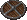
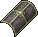

{ align=right }

# Parrying

## Overview

Parrying is a defensive skill that gives you a chance to absorb damage with your shield.

## How it works

If you are wearing a shield, each time you get hit, you have a chance to parry the attack and absorb some of the damage.

The chance is calculated by dividing your Parrying skill by 2, if you have 100 Parrying you will have a 50% chance to parry.

The amount of damage reduction depends on the Armor Rating of the shield used.

Melee attacks are reduced by half of the shield Armor Rating, while projectile attacks use the shield full AR.

Keep in mind that as your shield becomes damaged overtime, its AR will gradually decrease as well.

This table shows the Armor Rating for each shield type.

<!-- Tear kite shield needs to be added -->

=== "Normal"

    |                               Shield Type                               | AR  |
    |:-----------------------------------------------------------------------:|:---:|
    |     Buckler    |  7  |
    |      Wooden     |  8  |
    |      Bronze     | 10  |
    |       Metal      | 11  |
    |  Metal Kite | 16  |
    |      Heater     | 23  |
    |       Order      | 30  |
    |       Chaos      | 32  |

=== "GM Made"

    |                               Shield Type                               | AR  |
    |:-----------------------------------------------------------------------:|:---:|
    |     Buckler    |  8  |
    |      Wooden     |  -  |
    |      Bronze     | 12  |
    |       Metal      | 13  |
    |  Metal Kite | 19  |
    |      Heater     | 27  |
    |       Order      |  -  |
    |       Chaos      |  -  |

=== "Defense"

    |                               Shield Type                               | AR  |
    |:-----------------------------------------------------------------------:|:---:|
    |     Buckler    | 12  |
    |      Wooden     | 13  |
    |      Bronze     |  -  |
    |       Metal      |  -  |
    |  Metal Kite | 21  |
    |      Heater     |  -  |
    |       Order      |  -  |
    |       Chaos      |  -  |

=== "Guarding"

    |                               Shield Type                               | AR  |
    |:-----------------------------------------------------------------------:|:---:|
    |     Buckler    | 17  |
    |      Wooden     | 18  |
    |      Bronze     |  -  |
    |       Metal      |  -  |
    |  Metal Kite | 26  |
    |      Heater     |  -  |
    |       Order      |  -  |
    |       Chaos      |  -  |

=== "Hardening"

    |                               Shield Type                               | AR  |
    |:-----------------------------------------------------------------------:|:---:|
    |     Buckler    | 22  |
    |      Wooden     | 23  |
    |      Bronze     |  -  |
    |       Metal      |  -  |
    |  Metal Kite | 31  |
    |      Heater     |  -  |
    |       Order      |  -  |
    |       Chaos      |  -  |

=== "Fortification"

    |                               Shield Type                               | AR  |
    |:-----------------------------------------------------------------------:|:---:|
    |     Buckler    | 27  |
    |      Wooden     | 28  |
    |      Bronze     |  -  |
    |       Metal      |  -  |
    |  Metal Kite | 36  |
    |      Heater     |  -  |
    |       Order      |  -  |
    |       Chaos      |  -  |

=== "Invulnerability"

    |                               Shield Type                               | AR  |
    |:-----------------------------------------------------------------------:|:---:|
    |     Buckler    | 32  |
    |      Wooden     | 33  |
    |      Bronze     |  -  |
    |       Metal      |  -  |
    |  Metal Kite | 41  |
    |      Heater     |  -  |
    |       Order      |  -  |
    |       Chaos      |  -  |

## Shield Bash

Double click on your shield to activate the Shield Bash ability.

If active when you get hit, you will be able to absorb Fire Breath damage.

<!-- Not sure how it gets calculated and if it only works against Fire Breath -->

## Training

Parrying is hard to train because you will only gain when taking damage, it works best if trained while having a low combat skill as you get hit more often.

Gain is based on base damage before armor reduction, getting hit by multiple monsters increases gain speed.

## Related skills

- [Swordsmanship](swordsmanship.md)
- [Mace Fighting](mace-fighting.md)
- [Fencing](fencing.md)
