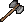

{ align=right }

# Swordsmanship

## Overview

Swordsmanship is the mastery of bladed weapons, it allows you to use a great variety of swords, poles and axes.

Higher combat skill makes you less likely to be hit.

## Lumberjacking bonus

Combining Lumberjacking with Swordsmanship gives you bonus damage.

The bonus gets calculated with this formula:

`(Lumberjacking Skill ÷ 10 - 2) + (1 if GM)`

So if you have 50 Lumberjacking you will get +3 on your damage, if you have 99.9, +8 and if you have 100, +9.

## Weapons

This table doesn't take into account the Strength, Dexterity and Tactics of the attacker or the Armor Rating of the defender.

Weapons are considered being at full durability.

=== "One Handed"

    |                                  Weapon                                  | STR Required |   Damage roll    | Speed |
    |:------------------------------------------------------------------------:|:------------:|:----------------:|:-----:|
    |  Skinning Knife |      5       |  1d10 (1-10)  |  40   |
    |         Cleaver        |      10      | 1d12+1 (2-13) |  40   |
    |   Butcher Knife  |      5       |  2d7 (2-14)   |  40   |
    |         Pickaxe        |      25      |  1d15 (1-15)  |  35   |
    |          Katana         |      10      | 3d8+2 (5-26)  |  58   |
    |         Cutlass        |      10      | 2d12+4 (6-28) |  45   |
    |     Broad Sword    |      25      | 2d13+3 (5-29) |  45   |
    |        Scimitar       |      10      | 2d14+2 (4-30) |  43   |
    |      Long Sword     |      25      | 2d15+3 (5-33) |  35   |
    |       Longsword      |      25      | 2d15+3 (5-33) |  35   |
    |    Viking Sword   |      40      | 4d8+2 (6-34)  |  30   |

=== "Two Handed"

    |                                    Weapon                                    | STR Required |   Damage roll    | Speed |
    |:----------------------------------------------------------------------------:|:------------:|:----------------:|:-----:|
    |           Hatchet          |      15      | 1d16+1 (2-17) |  40   |
    |  Executioner's Axe |      35      | 3d10+3 (6-33) |  37   |
    |               Axe              |      35      | 3d10+3 (6-33) |  37   |
    |        Double Axe       |      45      | 1d31+4 (5-35) |  37   |
    |  Large Battle Axe |      40      | 2d17+4 (6-38) |  30   |
    |        Battle Axe       |      40      | 2d17+4 (6-38) |  30   |
    |    Two-handed Axe   |      35      | 2d18+3 (5-39) |  30   |
    |          Bardiche         |      40      | 2d20+3 (5-43) |  26   |
    |           Halberd          |      45      | 2d23+3 (5-49) |  25   |

## Concussion Blow

Combining Swordsmanship with Anatomy lets you use the Concussion Blow special ability with Bardiche, Halberds and Two-handed Axes.

The success rate is calculated by dividing your Anatomy skill by 4. GM Anatomy equals to 25% success rate.

On a successful hit you will reduce the target Intelligence by 25% for 30 seconds. During the effect the target can't be concussed again.

## Training

Train from Weaponsmith NPCs to reach around 30.

To gain you will need to repeatedly attack a target.

To be more efficient have two characters fight using Healing and Anatomy on each other, this way you can train Healing, Anatomy and Tactics at the same time. Have the target equip high amor rating and a weapon they have 0 skill with, hit them until you reach 81, then switch the target weapon with one they are GM with and continue until 100.

## Related skills

- [Lumberjacking](../resource-gathering/lumberjacking.md)
- [Anatomy](anatomy.md)
