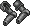
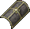
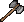
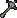

{ align=right }

# Blacksmithy

## Overview

Blacksmithy allows you to craft and repair metal weapons and armors.

## Tools

In order to start crafting, you will need Tongs or a Smith's Hammer, you can purchase them from blacksmith vendors.

To use them you will need to be near an Anvil & Forge.

## Crafting list

These are all the weapons and armor you can craft.

=== "Ringmail"

    |                                 Item                                  | Resources | Skill |
    |:---------------------------------------------------------------------:|:---------:|:-----:|
    |    Gloves   | 10 ingots | 12.0  |
    |  Leggings | 16 ingots | 19.4  |
    |   Sleeves  | 14 ingots | 16.9  |
    |     Tunic    | 18 ingots | 21.9  |

=== "Chainmail"

    |                                  Item                                  | Resources | Skill |
    |:----------------------------------------------------------------------:|:---------:|:-----:|
    |      Coif     | 10 ingots | 14.5  |
    |  Leggings | 18 ingots | 36.7  |
    |     Tunic    | 20 ingots | 39.1  |

=== "Platemail"

    |                                       Item                                       | Resources | Skill |
    |:--------------------------------------------------------------------------------:|:---------:|:-----:|
    |           Arms          | 18 ingots | 66.3  |
    |         Gloves        | 12 ingots | 58.9  |
    |         Gorget        | 10 ingots | 56.4  |
    |           Legs          | 20 ingots | 68.8  |
    |          Tunic         | 25 ingots | 75.0  |
    |  Tunic (Female) | 20 ingots | 44.1  |

=== "Helmets"

    |                                Item                                | Resources | Skill |
    |:------------------------------------------------------------------:|:---------:|:-----:|
    |     Bascinet    | 15 ingots |  8.3  |
    |  Close Helm | 15 ingots | 37.9  |
    |       Helmet      | 15 ingots | 37.9  |
    |   Norse Helm  | 15 ingots | 37.9  |
    |   Plate Helm  | 15 ingots | 62.6  |

=== "Shields"

    |                                      Item                                      | Resources | Skill |
    |:------------------------------------------------------------------------------:|:---------:|:-----:|
    |        Buckler        | 10 ingots |  <1   |
    |      Bronze Shield     | 12 ingots |  <1   |
    |      Heater Shield     | 18 ingots | 24.3  |
    |       Metal Shield      | 14 ingots |  <1   |
    |  Metal Kite Shield | 16 ingots |  4.6  |
    |   Tear Kite Shield  | 8 ingots  |  <1   |

=== "Bladed"

    |                                 Item                                 | Resources | Skill |
    |:--------------------------------------------------------------------:|:---------:|:-----:|
    |   Broad Sword  | 10 ingots | 35.4  |
    |       Cutlass      | 8 ingots  | 24.3  |
    |        Dagger       | 3 ingots  |  <1   |
    |        Katana       | 8 ingots  | 44.1  |
    |         Kryss        | 8 ingots  | 36.7  |
    |    Long Sword    | 12 ingots | 28.0  |
    |      Scimitar     | 10 ingots | 31.7  |
    |  Viking Sword | 14 ingots | 24.3  |

=== "Axes"

    |                                     Item                                     | Resources | Skill |
    |:----------------------------------------------------------------------------:|:---------:|:-----:|
    |               Axe              | 14 ingots | 34.2  |
    |        Battle Axe       | 14 ingots | 30.5  |
    |        Double Axe       | 12 ingots | 29.3  |
    |  Executioner's Axe | 16 ingots | 34.2  |
    |  Large Battle Axe | 14 ingots | 28.0  |
    |    Two-handed Axe   | 16 ingots | 33.0  |
    |           War Axe          | 16 ingots | 39.1  |

=== "Polearms"

    |                                Item                                | Resources | Skill |
    |:------------------------------------------------------------------:|:---------:|:-----:|
    |     Bardiche    | 18 ingots | 45.3  |
    |      Halberd     | 20 ingots | 49.0  |
    |  Short Spear | 6 ingots  | 45.3  |
    |        Spear       | 12 ingots | 49.0  |
    |     War Fork     | 12 ingots | 37.9  |

=== "Bashing"

    |                                Item                                | Resources | Skill |
    |:------------------------------------------------------------------:|:---------:|:-----:|
    |  Hammer Pick | 18 ingots | 25.6  |
    |         Mace        | 6 ingots  | 14.5  |
    |         Maul        | 10 ingots | 19.4  |
    |     War Mace    | 14 ingots | 28.0  |
    |   War Hammer  | 16 ingots | 34.2  |

## Repair deed

To craft a repair deed you will need a blank scroll, use your tool, click repair and target the scroll.

## Bulk order deeds

A minimum skill of 70.1 (real) is required to get a BOD.

You must have 85.1 (real) or higher for a chance to get a large BOD.

The BOD 6-hour time limit applies to your whole account.

### BOD Rewards

!!! info "Rewards list"
    You can get rewards from BODs but they are not listed here yet.

## Training

Training Blacksmithy can be really expensive, consider Mining to fund the training.

| Skill      | Item             |
|------------|------------------|
| 0 - 30     | Train from NPCs  |
| 30 - 50    | Maul             |
| 50 - 70    | Kryss            |
| 70 - 86    | Short spear      |
| 86 - 94.5  | Platemail gorget |
| 94.5 - 100 | Platemail gloves |

## Related skills

- [Mining](../resource-gathering/mining.md)
