{ align=right }

# Carpentry

## Overview

Carpentry allows you to craft wooden furniture and instruments.

## Tools

In order to start crafting, you will need a Saw tool, you can purchase one from carpenters vendors.

## Crafting list

These are all of the furniture, containers, instruments etc. you can craft.

=== "Other"

    |                                            Item                                            |     Resources     | Dyeable |     Skill      |
    |:------------------------------------------------------------------------------------------:|:-----------------:|:-------:|:--------------:|
    |            Barrel Staves           | 5 Boards or Logs  |   no    | 0.0 Carpentry  |
    |               Barrel Lid              | 4 Boards or Logs  |   no    | 11.0 Carpentry |
    |  Short Music Stand (left) | 15 Boards or Logs |   yes   | 78.9 Carpentry |
    |   Tall Music Stand (left)  | 20 Boards or Logs |   yes   | 81.5 Carpentry |
    |             Easel (south)            | 20 Boards or Logs |   no    | 86.8 Carpentry |

=== "Furniture"

    |                                       Item                                       |            Resources             | Dyeable |              Skill               |
    |:--------------------------------------------------------------------------------:|:--------------------------------:|:-------:|:--------------------------------:|
    |          Foot Stool         |         9 Boards or Logs         |   yes   |          11.0 Carpentry          |
    |               Stool              |         9 Boards or Logs         |   yes   |          11.0 Carpentry          |
    |         Straw Chair        |        13 Boards or Logs         |   yes   |          21.0 Carpentry          |
    |        Wooden Chair       |        13 Boards or Logs         |   yes   |          21.0 Carpentry          |
    |     Vesper Style Chair    |        15 Boards or Logs         |   yes   |          42.1 Carpentry          |
    |    Trinsic Style Chair   |        15 Boards or Logs         |   yes   |          42.1 Carpentry          |
    |        Wooden Bench       |        17 Boards or Logs         |   yes   |          52.6 Carpentry          |
    |       Wooden Throne      |        17 Boards or Logs         |   yes   |          52.6 Carpentry          |
    |  Magincia Style Throne |        19 Boards or Logs         |   yes   |          73.6 Carpentry          |
    |        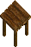 Small Table        |        17 Boards or Logs         |   yes   |          42.1 Carpentry          |
    |      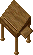 Writing Table      |        17 Boards or Logs         |   yes   |          63.1 Carpentry          |
    |        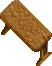 Large Table        |        23 Boards or Logs         |   yes   |          63.1 Carpentry          |
    |     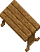 Yew-Wood Table     |        27 Boards or Logs         |   yes   |          84.2 Carpentry          |
    |            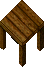 Counter            |        22 Boards or Logs         |   no    |          84.2 Carpentry          |
    |    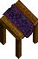 Counter (Purple)    | 22 Oak Boards or Logs 5 Cloth |   no    | 88.6 Carpentry 84.2 Tailoring |
    |     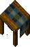 Counter (Green)     | 22 Oak Boards or Logs 5 Cloth |   no    | 88.6 Carpentry 84.2 Tailoring |

=== "Containers"

    |                                 Item                                 |                     Resources                     | Dyeable |     Skill      |
    |:--------------------------------------------------------------------:|:-------------------------------------------------:|:-------:|:--------------:|
    |    Wooden Box   |                 10 Boards or Logs                 |   yes   | 21.0 Carpentry |
    |   Small Crate  |                 8 Boards or Logs                  |   yes   | 10.0 Carpentry |
    |  Medium Crate |                 15 Boards or Logs                 |   yes   | 31.5 Carpentry |
    |   Large Crate  |                 18 Boards or Logs                 |   yes   | 47.3 Carpentry |
    |  Wooden Chest |                 20 Boards or Logs                 |   yes   | 73.6 Carpentry |
    |  Wooden Shelf |                 25 Boards or Logs                 |   yes   | 31.5 Carpentry |
    |  Armoire (Red) |                 35 Boards or Logs                 |   yes   | 84.2 Carpentry |
    |       Armoire      |                 35 Boards or Logs                 |   yes   | 84.2 Carpentry |
    |           Keg          | 3 Barrel Staves 1 Barrel Hoops 1 Barrel Lid |   no    | 57.8 Carpentry |

=== "Weapons and Armor"

    |                                   Item                                    |          Resources          | Dyeable |              Skill               |
    |:-------------------------------------------------------------------------:|:---------------------------:|:-------:|:--------------------------------:|
    |  Shepherd's Crook |      7 Boards or Logs       |   no    |          78.9 Carpentry          |
    |    Quarter Staff   |      6 Boards or Logs       |   no    |          73.6 Carpentry          |
    |   Gnarled Staff   |      7 Boards or Logs       |   no    |          78.9 Carpentry          |
    |    Fishing Pole    | 5 Boards or Logs 5 Cloth |   no    | 68.4 Carpentry 40.0 Tailoring |
    |   Wooden Shield   |      9 Boards or Logs       |   no    |          52.6 Carpentry          |

=== "Instruments"

    |                                       Item                                       |           Resources           | Dyeable |                Skill                |
    |:--------------------------------------------------------------------------------:|:-----------------------------:|:-------:|:-----------------------------------:|
    |            Lap Harp           | 20 Boards or Logs 10 Cloth |   no    | 63.1 Carpentry 45.0 Musicianship |
    |       Standing Harp      | 35 Boards or Logs 15 Cloth |   no    | 78.9 Carpentry 45.0 Musicianship |
    |                Drum               | 20 Boards or Logs 10 Cloth |   no    | 57.8 Carpentry 45.0 Musicianship |
    |                Lute               | 25 Boards or Logs 10 Cloth |   no    | 68.4 Carpentry 45.0 Musicianship |
    |          Tambourine         | 15 Boards or Logs 10 Cloth |   no    | 57.8 Carpentry 45.0 Musicianship |
    |  Tambourine (tassel) | 15 Boards or Logs 15 Cloth |   no    | 57.8 Carpentry 45.0 Musicianship |

=== "Misc. Add-Ons"

    |                                     Item                                      |            Resources            | Dyeable |              Skill               |
    |:-----------------------------------------------------------------------------:|:-------------------------------:|:-------:|:--------------------------------:|
    | 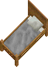 Small Bed (south)  | 100 Boards or Logs 100 Cloth |   no    | 94.7 Carpentry 75.0 Tailoring |
    |  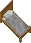 Small Bed (east)   | 100 Boards or Logs 100 Cloth |   no    | 94.7 Carpentry 75.0 Tailoring |
    | 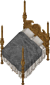 Large Bed (south)  | 150 Boards or Logs 150 Cloth |   no    | 94.7 Carpentry 75.0 Tailoring |
    |  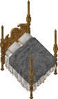 Large Bed  (east)  | 150 Boards or Logs 150 Cloth |   no    | 94.7 Carpentry 75.0 Tailoring |
    |  Dart Board (south) |        5 Boards or Logs         |   no    |          15.7 Carpentry          |
    |   Dart Board (east)  |        5 Boards or Logs         |   no    |          15.7 Carpentry          |
    |       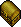 Ballot Box        |        10 Boards or Logs        |   no    |          47.3 Carpentry          |
    |         Pentagram         | 100 Boards or Logs 40 Ingots |   no    |  100.0 Carpentry 75.0 Magery  |
    |          Abattoir          | 100 Boards or Logs 40 Ingots |   no    |  100.0 Carpentry 50.0 Magery  |

=== "Blacksmithing"

    |                                       Item                                       |           Resources            | Dyeable |                Skill                 |
    |:--------------------------------------------------------------------------------:|:------------------------------:|:-------:|:------------------------------------:|
    |         Small Forge        | 5 Boards or Logs 75 Ingots  |   no    | 73.6 Carpentry 75.0 Blacksmithing |
    |  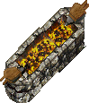 Large Forge (east)  | 5 Boards or Logs 100 Ingots |   no    | 78.9 Carpentry 80.0 Blacksmithing |
    | 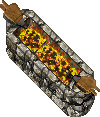 Large Forge (south) | 5 Boards or Logs 100 Ingots |   no    | 78.9 Carpentry 80.0 Blacksmithing |
    |         Anvil (east)        | 5 Boards or Logs 150 Ingots |   no    | 73.6 Carpentry 75.0 Blacksmithing |
    |        Anvil (south)       | 5 Boards or Logs 150 Ingots |   no    | 73.6 Carpentry 75.0 Blacksmithing |

=== "Training"

    |                                           Item                                           |           Resources           | Dyeable |              Skill               |
    |:----------------------------------------------------------------------------------------:|:-----------------------------:|:-------:|:--------------------------------:|
    |    Training Dummy (east)   | 55 Boards or Logs 60 Cloth |   no    | 68.4 Carpentry 50.0 Tailoring |
    |   Training Dummy (south)  | 55 Boards or Logs 60 Cloth |   no    | 68.4 Carpentry 50.0 Tailoring |
    |   Pickpockets Dip (east)  | 65 Boards or Logs 60 Cloth |   no    | 73.6 Carpentry 50.0 Tailoring |
    | 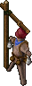 Pickpockets Dip (south) | 65 Boards or Logs 60 Cloth |   no    | 73.6 Carpentry 50.0 Tailoring |

=== "Tailoring and Cooking"

    |                                          Item                                          |           Resources           | Dyeable |              Skill               |
    |:--------------------------------------------------------------------------------------:|:-----------------------------:|:-------:|:--------------------------------:|
    |           Dressform          | 25 Boards or Logs 10 Cloth |   yes   | 63.1 Carpentry 65.0 Tailoring |
    |  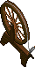 Spinning Wheel (east)  | 75 Boards or Logs 25 Cloth |   no    | 73.6 Carpentry 65.0 Tailoring |
    |  Spinning Wheel (south) | 75 Boards or Logs 25 Cloth |   no    | 73.6 Carpentry 65.0 Tailoring |
    |            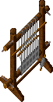 Loom (east)            | 85 Boards or Logs 25 Cloth |   no    | 84.2 Carpentry 65.0 Tailoring |
    |           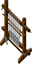 Loom (south)           | 85 Boards or Logs 25 Cloth |   no    | 84.2 Carpentry 65.0 Tailoring |

=== "Cooking"

    |                                        Item                                        |            Resources            | Dyeable |              Skill               |
    |:----------------------------------------------------------------------------------:|:-------------------------------:|:-------:|:--------------------------------:|
    |    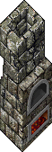 Stone Oven (east)    | 85 Boards or Logs 125 Ingots |   no    | 68.4 Carpentry 50.0 Tinkering |
    |   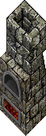 Stone Oven (south)   | 85 Boards or Logs 125 Ingots |   no    | 68.4 Carpentry 50.0 Tinkering |
    |    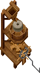 Flour Mill (east)    | 100 Boards or Logs 50 Ingots |   no    | 94.7 Carpentry 75.0 Tinkering |
    |   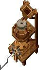 Flour Mill (south)   | 100 Boards or Logs 50 Ingots |   no    | 94.7 Carpentry 75.0 Tinkering |
    |  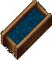 Water Trough (east)  |       150 Boards or Logs        |   no    |          94.7 Carpentry          |
    | 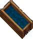 Water Trough (south) |       150 Boards or Logs        |   no    |          94.7 Carpentry          |

## Bulk order deeds

A minimum skill of 70.1 (real) is required to get a BOD.

You must have 85.1 (real) or higher for a chance to get a large BOD.

The BOD 6-hour time limit applies to your whole account.

### BOD Rewards

!!! info "Rewards list"
    You can get rewards from BODs but they are not listed here yet.

## Training

Consider Lumberjacking to fund the training.

| Skill       | Item            |
|-------------|-----------------|
| 0 - 30      | Train from NPCs |
| 30 - 47.3   | Medium Crate    |
| 47.3 - 71.1 | Ballot Box      |
| 71.1 - 75   | Fishing Pole    |
| 75 - 87     | Quarter Staff   |
| 87 - 100    | Gnarled Staff   |

## Related skills

- [Lumberjacking](../resource-gathering/lumberjacking.md)
- [Tailoring](../crafting/tailoring.md)
- [Blacksmithing](../crafting/blacksmithy.md)
- [Tinkering](../crafting/tinkering.md)
- [Musicianship](../bard-skills/musicianship.md)
- [Magery](../magic/magery.md)
