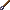
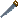
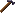
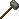
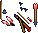
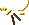
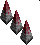
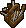

{ align=right }

# Tinkering

## Overview

Tinkering allows you to craft various tools and mechanical items including lockpicks.

## Tools

In order to start crafting, you will need a Tinker tool, you can purchase one from tinker vendors.

## Crafting list

These are all the tools and parts that you can craft.

=== "Wooden Items"

    |                                    Item                                    |    Resources     | Skill |
    |:--------------------------------------------------------------------------:|:----------------:|:-----:|
    |   Jointing Plane  | 4 Boards or Logs |   0   |
    |  Moulding Plane  | 4 Boards or Logs |   0   |
    |  Smoothing Plane | 4 Boards or Logs |   0   |
    |      Clock Frame     | 6 Boards or Logs |   0   |
    |             Axle            | 2 Boards or Logs |   0   |
    |      Rolling Pin     | 5 Boards or Logs |   0   |

=== "Tools"

    |                                      Item                                      | Resources | Skill |
    |:------------------------------------------------------------------------------:|:---------:|:-----:|
    |           Scissors          | 4 Ingots  |   5   |
    |  Mortar and Pestle | 3 Ingots  |  20   |
    |              Scorp             | 2 Ingots  |  30   |
    |        Tinker's tools       | 2 Ingots  |  10   |
    |            Hatchet           | 4 Ingots  |  30   |
    |         Draw Knife        | 2 Ingots  |  30   |
    |         Sewing Kit        | 2 Ingots  |  10   |
    |                Saw               | 4 Ingots  |  30   |
    |       Dovetail Saw      | 4 Ingots  |  30   |
    |               Froe              | 2 Ingots  |  30   |
    |             Shovel            | 4 Ingots  |  40   |
    |             Hammer            | 4 Ingots  |  30   |
    |              Tongs             | 4 Ingots  |  35   |
    |      Smith's Hammer     | 4 Ingots  |  40   |
    |      Sledge Hammer     | 4 Ingots  |  40   |
    |            Inshave           | 2 Ingots  |  30   |
    |            Pickaxe           | 4 Ingots  |  40   |
    |          Lockpick          | 1 Ingots  |  45   |
    |            Skillet           | 4 Ingots  |  30   |
    |       Flour Sifter      | 3 Ingots  |  50   |
    |     Fletcher's tool    | 3 Ingots  |  35   |
    |       Mapmaker's pen      | 1 Ingots  |  25   |
    |        Scribe's pen       | 1 Ingots  |  25   |

=== "Parts"

    |                                  Item                                  | Resources | Skill |
    |:----------------------------------------------------------------------:|:---------:|:-----:|
    |          Gears         | 2 Ingots  |   5   |
    |    Clock parts   | 1 Ingots  |  25   |
    |     Barrel Tap    | 2 Ingots  |  35   |
    |        Springs       | 2 Ingots  |   5   |
    |  Sextant parts | 4 Ingots  |  30   |
    |   Barrel Hoops  | 5 Ingots  |   0   |
    |         Hinge         | 2 Ingots  |   5   |
    |     Bola Balls    | 10 Ingots |  45   |

=== "Utensils"

    |                                   Item                                   | Resources | Skill |
    |:------------------------------------------------------------------------:|:---------:|:-----:|
    |   Butcher Knife  | 2 Ingots  |  25   |
    |     Spoon (left)    | 1 Ingots  |   0   |
    |    Spoon (right)   | 1 Ingots  |   0   |
    |           Plate          | 2 Ingots  |   0   |
    |      Fork (left)     | 1 Ingots  |   0   |
    |     Fork (right)    | 1 Ingots  |   0   |
    |         Cleaver        | 3 Ingots  |  20   |
    |     Knife (left)    | 1 Ingots  |   0   |
    |    Knife (right)   | 1 Ingots  |   0   |
    |          Goblet         | 3 Ingots  |  10   |
    |      Pewter Mug     | 2 Ingots  |  10   |
    |  Skinning knife | 2 Ingots  |  25   |

=== "Miscellaneous"

    |                                  Item                                  | Resources | Skill |
    |:----------------------------------------------------------------------:|:---------:|:-----:|
    |       Key ring      | 2 ingots  |  10   |
    |     Candelabra    | 4 ingots  |  55   |
    |         Scales        | 5 ingots  |  60   |
    |       Iron Key      | 3 ingots  |  20   |
    |          Globe         | 4 ingots  |  55   |
    |       Spyglass      | 4 ingots  |  60   |
    |        Lantern       | 2 ingots  |  30   |
    |  Heating stand | 4 ingots  |  60   |

=== "Jewelry"

    |                                             Item                                             |          Resources           | Skill |
    |:--------------------------------------------------------------------------------------------:|:----------------------------:|:-----:|
    |            Star Sapphire Ring            | 2 Ingots 1 Star Sapphires |  40   |
    |   Star Sapphire Necklace (Silver)  | 2 Ingots 1 Star Sapphires |  40   |
    |  Star Sapphire Necklace (Jewelled) | 2 Ingots 1 Star Sapphires |  40   |
    |        Star Sapphire Earrings        | 2 Ingots 1 Star Sapphires |  40   |
    |   Star Sapphire Necklace (Golden)  | 2 Ingots 1 Star Sapphires |  40   |
    |        Star Sapphire Bracelet        | 2 Ingots 1 Star Sapphires |  40   |
    |               Emerald Ring               |    2 Ingots 1 Emeralds    |  40   |
    |      Emerald Necklace (Silver)     |    2 Ingots 1 Emeralds    |  40   |
    |     Emerald Necklace (Jewelled)    |    2 Ingots 1 Emeralds    |  40   |
    |           Emerald Earrings           |    2 Ingots 1 Emeralds    |  40   |
    |      Emerald Necklace (Golden)     |    2 Ingots 1 Emeralds    |  40   |
    |           Emerald Bracelet           |    2 Ingots 1 Emeralds    |  40   |
    |               Sapphire Ring              | 2 Ingots 1 Star Sapphires |  40   |
    |     Sapphire Necklace (Silver)     | 2 Ingots 1 Star Sapphires |  40   |
    |     Sapphire Necklace (Jeweled)    | 2 Ingots 1 Star Sapphires |  40   |
    |           Sapphire Earrings          | 2 Ingots 1 Star Sapphires |  40   |
    |     Sapphire Necklace (Golden)     | 2 Ingots 1 Star Sapphires |  40   |
    |           Sapphire Bracelet          | 2 Ingots 1 Star Sapphires |  40   |
    |                 Ruby Ring                |     2 Ingots 1 Rubies     |  40   |
    |       Ruby Necklace (Silver)       |     2 Ingots 1 Rubies     |  40   |
    |       Ruby Necklace (Jeweled)      |     2 Ingots 1 Rubies     |  40   |
    |             Ruby Earrings            |     2 Ingots 1 Rubies     |  40   |
    |       Ruby Necklace (Golden)       |     2 Ingots 1 Rubies     |  40   |
    |             Ruby Bracelet            |     2 Ingots 1 Rubies     |  40   |
    |               Citrine Ring               |    2 Ingots 1 Citrines    |  40   |
    |      Citrine Necklace (Silver)     |    2 Ingots 1 Citrines    |  40   |
    |     Citrine Necklace (Jeweled)     |    2 Ingots 1 Citrines    |  40   |
    |           Citrine Earrings           |    2 Ingots 1 Citrines    |  40   |
    |      Citrine Necklace (Golden)     |    2 Ingots 1 Citrines    |  40   |
    |           Citrine Bracelet           |    2 Ingots 1 Citrines    |  40   |
    |               Amethyst Ring              | 2 Ingots 1 Amethyst Ring  |  40   |
    |     Amethyst Necklace (Silver)     | 2 Ingots 1 Amethyst Ring  |  40   |
    |     Amethyst Necklace (Jeweled)    | 2 Ingots 1 Amethyst Ring  |  40   |
    |           Amethyst Earrings          | 2 Ingots 1 Amethyst Ring  |  40   |
    |     Amethyst Necklace (Golden)     | 2 Ingots 1 Amethyst Ring  |  40   |
    |           Amethyst Bracelet          | 2 Ingots 1 Amethyst Ring  |  40   |
    |              Tourmaline Ring             |  2 Ingots 1 Tourmalines   |  40   |
    |    Tourmaline Necklace (Silver)    |  2 Ingots 1 Tourmalines   |  40   |
    |    Tourmaline Necklace (Jeweled)   |  2 Ingots 1 Tourmalines   |  40   |
    |          Tourmaline Earrings         |  2 Ingots 1 Tourmalines   |  40   |
    |    Tourmaline Necklace (Golden)    |  2 Ingots 1 Tourmalines   |  40   |
    |          Tourmaline Bracelet         |  2 Ingots 1 Tourmalines   |  40   |
    |                Amber Ring                |     2 Ingots 1 Amber      |  40   |
    |       Amber Necklace (Silver)      |     2 Ingots 1 Amber      |  40   |
    |      Amber Necklace (Jeweled)      |     2 Ingots 1 Amber      |  40   |
    |            Amber Earrings            |     2 Ingots 1 Amber      |  40   |
    |       Amber Necklace (Golden)      |     2 Ingots 1 Amber      |  40   |
    |            Amber Bracelet            |     2 Ingots 1 Amber      |  40   |
    |               Diamond Ring               |    2 Ingots 1 Diamonds    |  40   |
    |      Diamond Necklace (Silver)     |    2 Ingots 1 Diamonds    |  40   |
    |     Diamond Necklace (Jeweled)     |    2 Ingots 1 Diamonds    |  40   |
    |           Diamond Earrings           |    2 Ingots 1 Diamonds    |  40   |
    |      Diamond Necklace (Golden)     |    2 Ingots 1 Diamonds    |  40   |
    |           Diamond Bracelet           |    2 Ingots 1 Diamonds    |  40   |

=== "Assemblies"

    |                                    Item                                    |                            Resources                            | Skill |
    |:--------------------------------------------------------------------------:|:---------------------------------------------------------------:|:-----:|
    |  Axle and Gears |                        1 Axle 1 Gears                        |   0   |
    |      Clock Parts     |                 1 Axles with Gears 1 Springs                 |   0   |
    |    Sextant Parts   |                 1 Axles with Gears 1 Hinges                  |   0   |
    |     Clock (right)    |                 1 Clock Frames 1 Clock Parts                 |   0   |
    |      Clock (left)     |                 1 Clock Frames 1 Clock Parts                 |   0   |
    |          Sextant         |                         1 Sextant Parts                         |   0   |
    |            Bola            |               4 Bola Balls 3 Leather or Hides                |  60   |
    |       Potion Keg      | 1 Empty Kegs 10 Empty Bottles 1 Barrel Lids 1 Key Taps |  75   |

=== "Traps"

    |                                             Item                                             |                      Resources                       | Skill |
    |:--------------------------------------------------------------------------------------------:|:----------------------------------------------------:|:-----:|
    |                 Dart Trap                |             1 Ingots 1 Crossbow Bolts             |  30   |
    |               Poison Trap              |             1 Ingots 1 Green Potions              |  30   |
    |            Explosion Trap           |             1 Ingots 1 Purple Potions             |  55   |
    |          Faction Gas Trap         | 1000 Faction Silver 10 Ingots 1 Green Potions  |  65   |
    |    Faction Explosion Trap   | 1000 Faction Silver 10 Ingots 1 Purple Potions |  65   |
    |          Faction Saw Trap         |     1000 Faction Silver 10 Ingots 1 Gears      |  65   |
    |        Faction Spike Trap       |    1000 Faction Silver 10 Ingots 1 Springs     |  65   |
    |  Faction Trap Removal Kit |           500 Faction Silver 10 Ingots            |  65   |

## Training

Consider Mining to fund the training.

| Skill       | Item            |
|-------------|-----------------|
| 0 - 30      | Train from NPCs |
| 30.0 - 33.2 | Tinker's Tools  |
| 33.2 - 42.7 | Hammer          |
| 42.7 - 94.3 | Lockpick        |
| 94.3 - 100  | Spyglass        |

## Related skills

- [Lockpicking](../stealth-and-thievery/lockpicking.md)
- [Alchemy](alchemy.md)
- [Tailoring](tailoring.md)
- [Carpentry](carpentry.md)
- [Blacksmithy](blacksmithy.md)
- [Bowcraft/Fletching](bowcraft-fletching.md)
- [Mining](../resource-gathering/mining.md)
