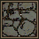
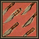
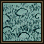
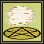

{ align=right }

# Magery

## Overview

Magery grants you ease of transportation and healing.

Combining Evaluating Intelligence with Magery will boost the damage of your spells.

Casting spells consumes mana, is a good idea to combine Magery with Meditation.

## Spells

Each Spell Circle adds 0.5 seconds of casting time. For example, a spell from Circle 1 takes 0.5 second to cast, while a spell from Circle 2 takes 1 second to cast, and so on.

If you fail to cast a spell from a spellbook, the reagents will still be consumed, but the mana won't.

=== "1st Circle"

    |                          Icon                           |     Spell      | Words of Power |               Reagents used               |
    |:-------------------------------------------------------:|:--------------:|:--------------:|:-----------------------------------------:|
    |          |     Clumsy     |    Uus Jux     |         Blood Moss Nightshade          |
    |     |  Create Food   |  In Mani Ylem  |    Garlic Ginseng Mandrake Root     |
    |      |   Feeblemind   |    Rel Wis     |           Nightshade Ginseng           |
    |            |      Heal      |    In Mani     |    Garlic Ginseng Spider's Silk     |
    |     |  Magic Arrow   |  In Por Ylem   |         Black Pearl Nightshade         |
    |     |  Night Sight   |     In Lor     |      Spider's Silk Sulphurous Ash      |
    |  | Reactive Armor |   Flam Sanct   | Garlic Spider's Silk Sulphurous Ash |
    |          |     Weaken     |    Des Mani    |           Garlic Nightshade            |

=== "2nd"

    |                         Icon                         |    Spell    | Words of Power |               Reagents used               |
    |:----------------------------------------------------:|:-----------:|:--------------:|:-----------------------------------------:|
    |      |   Agility   |     Ex Uus     |        Blood Moss Mandrake Root        |
    |      |   Cunning   |    Uus Wis     |        Nightshade Mandrake Root        |
    |         |    Cure     |     An Nox     |             Garlic Ginseng             |
    |         |    Harm     |    An Mani     |        Nightshade Spider's Silk        |
    |   | Magic Trap  |     In Jux     | Garlic Spider's Silk Sulphurous Ash |
    |  | Remove Trap |     An Jux     |       Blood Moss Sulphurous Ash        |
    |   | Protection  |   Uus Sanct    |    Garlic Ginseng Sulphurous Ash    |
    |     |  Strength   |    Uus Mani    |        Mandrake Root Nightshade        |

=== "3rd"

    |                          Icon                          |     Spell     | Words of Power |             Reagents used             |
    |:------------------------------------------------------:|:-------------:|:--------------:|:-------------------------------------:|
    |          |     Bless     |   Rel Sanct    |        Garlic Mandrake Root        |
    |       |   Fireball    |    Vas Flam    |              Black Pearl              |
    |     |  Magic Lock   |     An Por     | Bloodmoss Garlic Sulphurous Ash |
    |         |    Poison     |     In Nox     |              Nightshade               |
    |    |  Telekinesis  |  Ort Por Ylem  |      Blood Moss Mandrake Root      |
    |       |   Teleport    |    Rel Por     |      Blood Moss Mandrake Root      |
    |         |    Unlock     |     Ex Por     |     Blood Moss Sulphurous Ash      |
    |  | Wall of Stone | In Sanct Ylem  |         Blood Moss Garlic          |

=== "4th"

    |                          Icon                           |     Spell      | Words of Power |                    Reagents used                     |
    |:-------------------------------------------------------:|:--------------:|:--------------:|:----------------------------------------------------:|
    |        |    Archcure    |   Vas An Nox   |          Garlic Ginseng Mandrake Root          |
    |  | Archprotection | Vas Uus Sanct  | Garlic Ginseng Mandrake Root Sulphurous Ash |
    |           |     Curse      |   Des Sanct    |        Garlic Nightshade Sulphurous Ash        |
    |      |   Fire Field   |  In Flam Grav  |    Black Pearl Spider's Silk Sulphurous Ash    |
    |    |  Greater Heal  |  In Vas Mani   | Garlic Ginseng Mandrake Root Spider's Silk  |
    |       |   Lightning    |  Por Ort Grav  |    Black Pearl Mandrake Root Sulphurous Ash    |
    |      |   Mana Drain   |    Ort Rel     |    Black Pearl Mandrake Root Spider's Silk     |
    |          |     Recall     |  Kal Ort Por   |      Black Pearl Blood Moss Mandrake Root      |

=== "5th"

    |                           Icon                            |      Spell       | Words of Power  |                        Reagents used                         |
    |:---------------------------------------------------------:|:----------------:|:---------------:|:------------------------------------------------------------:|
    |     |  Blade Spirits   | In Jux Hur Ylem |          Black Pearl Mandrake Root Nightshade          |
    |      |   Dispel Field   |     An Grav     |   Black Pearl Garlic Spider's Silk Sulphurous Ash   |
    |         |    Incognito     |    Kal In Ex    |              Blood Moss Garlic Nightshade              |
    |  | Magic Reflection |  In Jux Sanct   |           Garlic Mandrake Root Spider's Silk           |
    |        |    Mind Blast    |  Por Corp Wis   | Black Pearl Mandrake Root Nightshade Sulphurous Ash |
    |          |     Paralyze     |    An Ex Por    |           Garlic Mandrake Root Spider's Silk           |
    |      |   Poison Field   |   In Nox Grav   |          Black Pearl Nightshade Spider's Silk          |
    |   | Summon Creature  |     Kal Xen     |         Blood Moss Mandrake Root Spider's Silk         |

=== "6th"

    |                          Icon                           |     Spell      | Words of Power |                      Reagents used                      |
    |:-------------------------------------------------------:|:--------------:|:--------------:|:-------------------------------------------------------:|
    |          |     Dispel     |     An Ort     |        Garlic Mandrake Root Sulphurous Ash        |
    |     |  Energy Bolt   |    Corp Por    |                Black Pearl Nightshade                |
    |       |   Explosion    |  Vas Ort Flam  |             Mandrake Root Sulphurous Ash             |
    |    |  Invisibility  |   An Lor Xen   |                Blood Moss Nightshade                 |
    |            |      Mark      |  Kal Por Ylem  |       Black Pearl Blood Moss Mandrake Root        |
    |      |   Mass Curse   | Vas Des Sanct  | Garlic Mandrake Root Nightshade Sulphurous Ash |
    |  | Paralyze Field |   In Ex Grav   |         Black Pearl Ginseng Spider's Silk         |
    |          |     Reveal     |    Wis Quas    |              Blood Moss Sulphurous Ash               |

=== "7th"

    |                           Icon                           |      Spell      |  Words of Power   |                          Reagents used                          |
    |:--------------------------------------------------------:|:---------------:|:-----------------:|:---------------------------------------------------------------:|
    |  | Chain Lightning |   Vas Ort Grav    |  Black Pearl Blood Moss Mandrake Root Sulphurous Ash   |
    |     |  Energy Field   |   In Sanct Grav   | Black Pearl Mandrake Root Spider's Silk Sulphurous Ash |
    |      |   Flamestrike   |   Kal Vas Flam    |                 Spider's Silk Sulphurous Ash                 |
    |      |   Gate Travel   |    Vas Rel Por    |         Black Pearl Mandrake Root Sulphurous Ash          |
    |     |  Mana Vampire   |     Ort Sanct     |     Black Pearl Blood Moss Mandrake Spider's Silk      |
    |      |   Mass Dispel   |    Vas An Ort     |    Black Pearl Garlic Mandrake Root Sulphurous Ash     |
    |     |  Meteor Swarm   | Kal Des Flam Ylem | Blood Moss Mandrake Root Spider's Silk Sulphurous Ash  |
    |        |    Polymorph    |   Vas Ylem Rel    |          Blood Moss Mandrake Root Spider's Silk           |

=== "8th"

    |                                     Icon                                     |       Spell        |   Words of Power    |                         Reagents used                          |
    |:----------------------------------------------------------------------------:|:------------------:|:-------------------:|:--------------------------------------------------------------:|
    |                          |     Earthquake     |     In Vas Por      |    Blood Moss Ginseng Mandrake Root Sulphurous Ash    |
    |                    |   Energy Vortex    |    Vas Corp Por     |    Black Pearl Blood Moss Mandrake Root Nightshade    |
    |                      |    Resurrection    |       An Corp       |                Blood Moss Garlic Ginseng                 |
    |      |  Summon Air Elem.  |   Kal Vas Xen Hur   |          Blood Moss Mandrake Root Spider's Silk          |
    |                    |   Summon Daemon    |  Kal Vas Xen Corp   | Blood Moss Mandrake Root Spider's Silk Sulphurous Ash |
    |  | Summon Earth Elem. |  Kal Vas Xen Ylem   |          Blood Moss Mandrake Root Spider's Silk          |
    |    | Summon Fire Elem.  |  Kal Vas Xen Flam   | Blood Moss Mandrake Root Spider's Silk Sulphurous Ash |
    |  | Summon Water Elem. | Kal Vas Xen An Flam |          Blood Moss Mandrake Root Spider's Silk          |

### Casting requirements

This table shows the minimum Skill required to attempt casting a Spell of a specific Circle (2% success rate), the number next to it shows the amount of skill needed to have achieve 99%.

|                          icon                           | Spell Circle | INT |    Skill    |
|:-------------------------------------------------------:|:------------:|:---:|:-----------:|
|    |    First     |  4  | 1.1 / 40.1  |
|   |    Second    |  6  | 6.1 / 50.1  |
|    |    Third     |  9  | 16.1 / 60.1 |
|   |    Fourth    | 11  | 26.1 / 70.1 |
|    |    Fifth     | 14  | 36.1 / 80.1 |
|    |    Sixth     | 20  | 51.8 / 90.1 |
|  |   Seventh    | 40  | 66.1 / ---- |
|    |    Eight     | 50  | 80.1 / ---- |

For every Skill point over the minimum, you get roughly a 2-3% chance increase to cast spells from that Circle, until you hit the 99% cap. Except for the First, Seventh and Eight circles.

### Spell scrolls

Success rate of scrolls works differently, they count as two Circles lower than normal. Casting an 8th Circle Earthquake scroll, for instance, depends on your 6th Circle spell skill.

Casting from scrolls does not require reagents. If successful, the mana consumed will be the same as for normal spells, and the scroll will disappear.

## Reagents

You can find Reagents from the ground, from looting monsters or from NPC vendors at mage shops. They are essential for casting and crafting spells, or for crafting potions.

This table show how much each reagent type is used when casting spells, for example Mandrake Root is used in 56% of all spells, with higher usage in Circles 5 trough 8.

|                                 Reagent                                  | All Circles | Circles 1 - 4 | Circles 5 - 8 |
|:------------------------------------------------------------------------:|:-----------:|:-------------:|:-------------:|
|   Mandrake Root  |     56%     |      41%      |      72%      |
|  Sulphurous Ash |     41%     |      34%      |      47%      |
|      Blood Moss     |     41%     |      28%      |      53%      |
|   Spider's Silk   |     39%     |      25%      |      53%      |
|          Garlic         |     34%     |      44%      |      25%      |
|     Black Pearl    |     30%     |      19%      |      41%      |
|      Nightshade     |     27%     |      28%      |      25%      |
|         Ginseng        |     17%     |      25%      |      9%       |

### Guild discount

Once you reach 100 Magery and become a Grand Master, you can join the Sorcerer's Guild by using the command `[vendor name] join` followed by a 5.000 gold fee. This grants you a 10% discount from mage vendors, which is helpful for stocking up on reagents.

### Wind access

Reaching 72 Magery skill grants access to Wind, the city of mages.

## Training

Training Magery can burn a hole in your pockets, so be sure to stockpile plenty of gold for those pricey reagents.

=== "Magery Only"

    | Skill    | Cast            |
    |----------|-----------------|
    | 0 - 30   | Train from NPCs |
    | 30 - 40  | Third Circle    |
    | 40 - 55  | Fourth Circle   |
    | 55 - 66  | Fifth Circle    |
    | 65 - 80  | Sixth Circle    |
    | 80 - 95  | Seventh Circle  |
    | 95 - 100 | Eighth Circle   |

=== "Magery and Resisting Spells"

    | Skill    | Cast :material-information-outline:{ title="Cast on yourself" }                       |
    |----------|---------------------------------------------------------------------------------------|
    | 0 - 30   | Train from NPCs                                                                       |
    | 30 - 55  | Fire Field :material-information-outline:{ title="Cast it and run across the field" } |
    | 55 - 60  | Lighting                                                                              |
    | 60 - 82  | Energy Bolt                                                                           |
    | 82 - 100 | Flamestrike                                                                           |

=== "Magery Only alternative"

    | Skill       | Cast            |
    |-------------|-----------------|
    | 0 - 30      | Train from NPCs |
    | 30 - 50.1   | Fourth Circle   |
    | 50.1 - 80.1 | Invisibility    |
    | 80.1 - 100  | Earthquake      |

## Related skills

- [Evaluating Intelligence](evaluating-intelligence.md)
- [Meditation](meditation.md)
