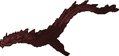

{ align=right }

# Fishing

## Overview

Fishing allows you to catch fish from any body of water, beyond basic fish for food, skilled fishermen can catch rare fish, treasure, and special items.

To avoid unattended gathering, all resource gathering activities will trigger the AFK captcha gump.

## Catches

This table shows what you can fish up.

=== "Skill requirements"

    | Skill |                                                                                                                          Loot                                                                                                                          |
    |:-----:|:------------------------------------------------------------------------------------------------------------------------------------------------------------------------------------------------------------------------------------------------------:|
    |   0   |                 Footwear Mostly on land              |
    |   0   |     Normal Fish If cut with a knife yields 4 fish steaks |
    |  25   |                                                                        Fishing Net Can be used to fish up sea monsters                                                                        |
    |  80   |                                                                                  Prize Fish +5 INT when eaten                                                                                  |
    |  80   |                                                                               Wondrous Fish +5 DEX when eaten                                                                               |
    |  80   |                                                                             Truly Rare Fish +5 STR when eaten                                                                             |
    |  80   |                                                                  Highly Peculiar Fish Restores 10 stamina when eaten                                                                 |
    |  90   |                                                                        Big Fish Shows weight, angler name and time of catch                                                                        |
    |  90   |                                                                      Sea Serpents, Deep Sea Serpents Drop details below                                                                     |
    |  100  |                                                                      Ancient Sea Serpents They drop Pirate maps                                                                     |

=== "Rare fishes"

<!-- -->

    |      Rare fishes      |
    |:---------------------:|
    |       Angelfish       |
    |  Banded Coral Shrimp  |
    |      Betta Fish       |
    |    Blue Damselfish    |
    |    Blue Parrotfish    |
    |   Blue Surgeonfish    |
    |       Blue Tang       |
    | Blue-Spotted Stingray |
    |  Blue/Yellow Chromis  |
    |   Cherub Angelfish    |
    |   Clown Triggerfish   |
    |       Clownfish       |
    |   Clownfish Variant   |
    |      Cuttlefish       |
    |   Emperor Angelfish   |
    |     Fiddler Crab      |
    |    Horseshoe Crab     |
    |       Jellyfish       |
    |   Leafy Sea Dragon    |
    |       Lionfish        |
    |     Moorish Idol      |
    | Orange Butterflyfish  |
    |   Orange Damselfish   |
    |    Orange Percula     |
    |       Pipe Fish       |
    |      Pufferfish       |
    |     Red Lionfish      |
    |       Seahorse        |
    |      Spider Crab      |
    |     Spiny Lobster     |
    |    Spotted Grouper    |
    |   Striped Angelfish   |
    | Striped Butterflyfish |
    |  Striped Damselfish   |
    |   White Damselfish    |
    | Yellow Butterflyfish  |
    |      Yellow Tang      |
    |  Yellow Tang Variant  |
    | Yellowtail Damselfish |

## Catch and release

Catch and release is an option found on the menu accessible by typing [profile in game.

If turned ON, you will release normal fishes into the water, it helps managing weight and inventory.

## Boats

You can buy a boat from Shipwright vendors in most docks.

## Sea serpents loot

While fishing you have a chance of pulling up Sea Serpents and Deep Sea Serpents.

In their loot they will guarantee one of these items.

|                              Sea serpents loot                               |
|:----------------------------------------------------------------------------:|
|       Fishing Net      |
|  Level 1 Treasure Map |
|  Archaeology Clue |
|   Message in a Bottle   |

## Fishing net

Fishing nets can have multiple colors, some more rare than others.

When used, they have a chance of pulling up Sea creatures such as Sea Serpents, Deep Sea Serpents, Water Elementals and Krakens.

Sea Serpents are guaranteed to be pulled up with a net and have a different loot from those fished up with a pole.

They don't have MiBs, but they have very rare chance of dropping a Level 2 Treasure Map.

Krakens can't be pulled up by pole fishing, they usually drop a Net and have a rare chance of having a MiB.

At the moment is better to keep Nets as decoration.

## Ink of the deep

You can extract Ink from rare fishes like the Octopus and the Cuttlefish using a knife.

You can use the Bottle of Extracted Ink on a Dye Tub to make a single use of pure black hue.

## Messages in a bottle

You can loot a Message in a bottle from Sea Serpents and Deep Sea Serpents.

Double click the bottle to reveal the Waterstained SOS, use the map to find the coordinates and fish up the treasure chest.

While trying to fish up the chest, you will also pull up random items such as bones, pillows, paintings and shells.

There is also a very rare chance of pulling up an Enraged kraken.

### Enraged kraken

Enraged Krakens will always drop a Strongbox, in them you can always find a Pirate map.

## Pirate maps

Pirate maps are dropped by Ancient Sea Serpents or found in Strongboxes dropped by Enraged Krakens.

You can only pull up two Ancient Sea Serpents a day for each account, after that limit you get a rare decoration item instead.

For more information about Pirate maps go [here](../../../custom-systems/pirate-adventures.md).

### Fishing rares

This table shows which rares you can get after reaching the daily Ancient Sea Serpents limit.

!!! warning
    Table under construction.

## Training

Train from Fisher NPCs to reach around 30.

Repeatedly fish until reaching 100, while fishing on land monster can't spawn and the gains are the same as fishing in deep sea.

Consider keeping the fish to also train cooking.

## Related skills

- [Cooking](../crafting/cooking.md)
