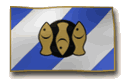

{ align=right }

# Fishing

## Overview

Fishing allows you to catch fish from any body of water. Beyond basic fish for food, skilled fishermen can catch rare fish, treasure, and special items.

All resource gathering activities will trigger the AFK captcha gump, to avoid unattended gathering.

## Catches

This table shows what can you fish up.

| Skill |                           Loot                           |
|:-----:|:--------------------------------------------------------:|
|   0   |                Footwear Mostly on land                |
|   0   | Normal Fish If cut with a knife yields 4 fish steaks  |
|  25   |    Fishing net Can be used to fish up sea monsters    |
|  80   |             Prize Fish +5 INT when eaten              |
|  80   |            Wondrous Fish +5 DEX when eaten            |
|  80   |           Truly Rare Fish +5 STR when eaten           |
|  80   |  Highly Peculiar Fish Restores 10 stamina when eaten  |
|  90   | Big Fish Shows weight, angler name and time of catch  |
|  90   | Sea Serpents They can drop Messages in a bottle (MiB) |
|  100  |    Ancient Sea Serpents They can drop Pirate maps     |

## Catch and release

Catch and release is an option found on the menu accessible by typing [profile in game.

If turned ON, you will release normal fishes into the water, it helps managing weight and inventory.
