{ align=right }

# Mining

## Overview

Mining allows you to extract ore from mountainsides and rocky areas, essential for blacksmiths.

To avoid unattended gathering, all resource gathering activities will trigger the AFK captcha gump.

## Types of iron

| Skill |                                   Iron                                    | Spawn |
|:-----:|:-------------------------------------------------------------------------:|:-----:|
|   0   |         Iron        |  50%  |
|  65   | 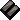 Dull Copper | 11.2% |
|  70   |      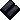 Shadow      | 9.8%  |
|  75   |      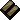 Copper      | 8.4%  |
|  80   |      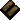 Bronze      | 7.0%  |
|  85   |      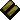 Golden      | 5.6%  |
|  90   |     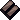 Agapite     | 4.2%  |
|  95   |      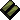 Verite      | 2.8%  |
|  99   |    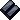 Valorite    | 1.4%  |

## Gathering

To be able to gather, you need to be on foot.

Double click the pickaxe or shovel and then the vein until it's depleted.

You can purchase a pickaxe or shovel from mining vendors.

Specific veins will always yield the same type of ore.

## Prospector tool

The Prospector Tool is a Blacksmith BOD reward.

When used, it can boost the ore vein by one level.

So for example an Agapite vein can be raised to Verite.

This effect can stack with the Gargoyle pickaxe.

## Gargoyle pickaxe

The Gargoyle pickaxe is a Blacksmith BOD reward.

When used, it can boost the ore vein by one level.

This effect can stack with the Prospector Tool.

So for example an Agapite vein can be raised to Verite using a Prospector Tool and then raise to Valorite with the Gargoyle pickaxe.

When using the Gargoyle pickaxe there is a chance of spawning an Ore Elemental of the same color of the ore you are mining.

Gargoyles and Stone Gargoyles can also drop a Gargoyle pickaxe.

## Mining gloves

Mining gloves are a Blacksmith BOD reward.

Leather Mining Gloves add 1.0 points of mining.

Studded Mining Gloves add 3.0 points of mining.

Ringmail Mining Gloves add 5.0 points of mining.

They can be used to help training.

## Ore to ingot

You can combine different ore piles together by double clicking them.

For example you could turn Large Piles into Small Piles to better manage weight and smelting.

|                                    Ore                                     |    Weight    |                   Ingots on Successful smelt                   |
|:--------------------------------------------------------------------------:|:------------:|:--------------------------------------------------------------:|
|   2 Small Piles   | 2 * 2 Stones |  1 Ingot  |
| 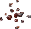 1 Medium Pile |   7 Stones   |  1 Ingot  |
| 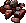 1 Medium Pile |   7 Stones   |  1 Ingot  |
|   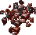 1 Large Pile   |  12 Stones   |  2 Ingot |

## Smelting

To smelt double click the ore and then a forge, if successful you will get an ingot, if not, you will lose the ore.

This table shows the smelt chance based on mining level.

=== "0 - 20"

    |     Ore     | Smelt chance |
    |:-----------:|:------------:|
    |    Iron     |      0%      |
    | Dull Copper |      0%      |
    |   Shadow    |      0%      |
    |   Copper    |      0%      |
    |   Bronze    |      0%      |
    |   Golden    |      0%      |
    |   Agapite   |      0%      |
    |   Verite    |      0%      |
    |  Valorite   |      0%      |

=== "30"

    |     Ore     | Smelt chance |
    |:-----------:|:------------:|
    |    Iron     |     10%      |
    | Dull Copper |      0%      |
    |   Shadow    |      0%      |
    |   Copper    |      0%      |
    |   Bronze    |      0%      |
    |   Golden    |      0%      |
    |   Agapite   |      0%      |
    |   Verite    |      0%      |
    |  Valorite   |      0%      |

=== "40"

    |     Ore     | Smelt chance |
    |:-----------:|:------------:|
    |    Iron     |     30%      |
    | Dull Copper |      0%      |
    |   Shadow    |      0%      |
    |   Copper    |      0%      |
    |   Bronze    |      0%      |
    |   Golden    |      0%      |
    |   Agapite   |      0%      |
    |   Verite    |      0%      |
    |  Valorite   |      0%      |

=== "50"

    |     Ore     | Smelt chance |
    |:-----------:|:------------:|
    |    Iron     |     50%      |
    | Dull Copper |      0%      |
    |   Shadow    |      0%      |
    |   Copper    |      0%      |
    |   Bronze    |      0%      |
    |   Golden    |      0%      |
    |   Agapite   |      0%      |
    |   Verite    |      0%      |
    |  Valorite   |      0%      |

=== "60"

    |     Ore     | Smelt chance |
    |:-----------:|:------------:|
    |    Iron     |     70%      |
    | Dull Copper |      0%      |
    |   Shadow    |      0%      |
    |   Copper    |      0%      |
    |   Bronze    |      0%      |
    |   Golden    |      0%      |
    |   Agapite   |      0%      |
    |   Verite    |      0%      |
    |  Valorite   |      0%      |

=== "70"

    |     Ore     | Smelt chance |
    |:-----------:|:------------:|
    |    Iron     |     90%      |
    | Dull Copper |     60%      |
    |   Shadow    |     50%      |
    |   Copper    |      0%      |
    |   Bronze    |      0%      |
    |   Golden    |      0%      |
    |   Agapite   |      0%      |
    |   Verite    |      0%      |
    |  Valorite   |      0%      |

=== "80"

    |     Ore     | Smelt chance |
    |:-----------:|:------------:|
    |    Iron     |     100%     |
    | Dull Copper |     80%      |
    |   Shadow    |     70%      |
    |   Copper    |     60%      |
    |   Bronze    |     50%      |
    |   Golden    |      0%      |
    |   Agapite   |      0%      |
    |   Verite    |      0%      |
    |  Valorite   |      0%      |

=== "90"

    |     Ore     | Smelt chance |
    |:-----------:|:------------:|
    |    Iron     |     100%     |
    | Dull Copper |     100%     |
    |   Shadow    |     90%      |
    |   Copper    |     80%      |
    |   Bronze    |     70%      |
    |   Golden    |     60%      |
    |   Agapite   |     50%      |
    |   Verite    |      0%      |
    |  Valorite   |      0%      |

=== "100"

    |     Ore     | Smelt chance |
    |:-----------:|:------------:|
    |    Iron     |     100%     |
    | Dull Copper |     100%     |
    |   Shadow    |     100%     |
    |   Copper    |     100%     |
    |   Bronze    |     90%      |
    |   Golden    |     80%      |
    |   Agapite   |     70%      |
    |   Verite    |     60%      |
    |  Valorite   |     52%      |

=== "101"

    |     Ore     | Smelt chance |
    |:-----------:|:------------:|
    |    Iron     |     100%     |
    | Dull Copper |     100%     |
    |   Shadow    |     100%     |
    |   Copper    |     100%     |
    |   Bronze    |     92%      |
    |   Golden    |     82%      |
    |   Agapite   |     72%      |
    |   Verite    |     63%      |
    |  Valorite   |     54%      |

=== "103"

    |     Ore     | Smelt chance |
    |:-----------:|:------------:|
    |    Iron     |     100%     |
    | Dull Copper |     100%     |
    |   Shadow    |     100%     |
    |   Copper    |     100%     |
    |   Bronze    |     96%      |
    |   Golden    |     86%      |
    |   Agapite   |     76%      |
    |   Verite    |     66%      |
    |  Valorite   |     58%      |

=== "105"

    |     Ore     | Smelt chance |
    |:-----------:|:------------:|
    |    Iron     |     100%     |
    | Dull Copper |     100%     |
    |   Shadow    |     100%     |
    |   Copper    |     100%     |
    |   Bronze    |     100%     |
    |   Golden    |     90%      |
    |   Agapite   |     80%      |
    |   Verite    |     70%      |
    |  Valorite   |     62%      |

At GM you can safely smelt Iron, Dull Copper, Shadow and Copper ores.

When smelting anything above Copper, it's recommended to combine the ores into small piles and smelt them 2 at a time, otherwise you will risk the entire stack.

## Archaeology

Mining is one of the skill required for Excavation in the Archaeology system, alongside with Item Identification.

For more information about the system go [here](../../../custom-systems/archaeology.md).

## Training

Train from Miner NPCs to reach around 50.

Smelting ore gives faster gains than mining, when the chance of smelt is lower.

Repeatedly mine and/or smelt until reaching 100.

## Related skills

- [Blacksmithy](../crafting/blacksmithy.md)
