{ align=right }

# Animal Taming

## Overview

Animal Taming allows you to befriend wild creatures and command them in combat.

## Stable slots

The amount of available stable slots is determined by the total Animal Taming, Animal Lore and Veterinary of the player, for a max of 30 slots.

Every player has a minimum of 5 slots regardless of skill.

## Taming requirements

Anyone can tame a Horse regardless of skill.

Animals that require a skill of 29.1 or less will follow anyone's orders.

High Animal Taming and Animal Lore will help controlling harder animals, a check is made by comparing the required taming level to 70% Taming plus 30% Lore of the player.

Dragons, Drakes and Nightmare have the Fire Breath ability, proportionate to their remaining HP.

This table shows the minimum skill required to start taming, the damage only shows melee without considering magery and fire breath.

|                              Creature Name                              | Skill | Damage |    HP     |   AR   |
|:-----------------------------------------------------------------------:|:-----:|:------:|:---------:|:------:|
|           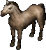 Horse           |   0   | 2 - 10 | 44 - 120  |   7    |
|          Chicken         | - 0.9 |   1    |   2 - 8   |   1    |
|    Tropical Bird   | - 0.9 |   1    |   3 - 6   |   1    |
|            Raven           | - 0.9 |   1    |  5 - 15   |   3    |
|             Crow            | - 0.9 |   1    |  5 - 15   |   1    |
|           Magpie          | - 0.9 |   1    |  5 - 15   |   1    |
|              Cat             | - 0.9 |   1    |  7 - 17   |   4    |
|          Mongbat         | - 0.9 | 1 - 2  |   4 - 8   |   5    |
|   Rabbit Jack Rabbit   | - 0.9 | 1 - 2  |   4 - 8   | 2 - 5  |
|        Sewer Rat       | - 0.9 | 1 - 2  |     9     |   3    |
|              Rat             | - 0.9 | 1 - 4  |  9 - 17   |   5    |
|              Dog             | - 0.9 | 1 - 4  |  28 - 37  |   3    |
|             Boar            | - 0.9 | 1 - 4  |  41 - 59  |   5    |
|    Mountain Goat   | - 0.9 | 1 - 5  |  22 - 64  | 2 - 6  |
|          Gorilla         | - 0.9 | 2 - 12 |  53 - 95  |   14   |
|            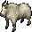 Goat            | 11.1  | 1 - 3  |  21 - 29  |   3    |
|           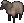 Sheep           | 11.1  | 1 - 3  |  21 - 49  | 1 - 3  |
|              Pig             | 11.1  | 1 - 3  |  23 - 65  |   4    |
|             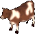 Cow             | 11.1  | 1 - 4  |  45 - 85  | 2 - 12 |
|            Eagle           | 17.1  | 2 - 8  |  30 - 40  |   9    |
|        Bull Frog       | 23.1  | 1 - 2  |  46 - 70  |   8    |
|            Slime           | 23.1  | 1 - 5  |  22 - 34  | 1 - 4  |
|            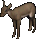 Hind            | 23.1  | 1 - 8  |  31 - 49  |   5    |
|      Timber Wolf     | 23.1  | 2 - 8  |  55 - 80  |   7    |
|       Pack Llama      | 29.1  | 1 - 5  |  31 - 49  | 2 - 6  |
|        Giant Rat       | 29.1  | 2 - 8  |  22 - 64  |   8    |
|      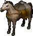 Pack Horse      | 29.1  | 2 - 10 | 44 - 120  |   7    |
|    Forest Ostard   | 29.1  | 4 - 12 | 94 - 170  |   9    |
|    Ridable Llama   | 29.1  | 4 - 12 | 94 - 170  |   9    |
|    Desert Ostard   | 29.1  | 7 - 15 | 94 - 170  |   9    |
|           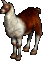 Llama           | 35.1  | 1 - 5  |  31 - 49  | 2 - 6  |
|       Black Bear      | 35.1  | 2 - 12 | 75 - 100  |   8    |
|          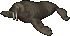 Walrus          | 35.1  | 3 - 6  |  21 - 29  | 2 - 12 |
|       Polar Bear      | 35.1  | 3 - 12 | 115 - 140 |   7    |
|          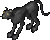 Cougar          | 41.1  | 2 - 10 |  55 - 80  |   6    |
|       Brown Bear      | 41.1  | 3 - 11 | 75 - 100  |   10   |
|       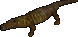 Alligator       | 47.1  | 2 - 14 | 75 - 100  |   12   |
|         Scorpion        | 47.1  | 3 - 12 | 73 - 115  |   12   |
|       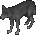 Grey Wolf       | 53.1  | 2 - 8  |  55 - 80  |   9    |
|    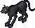 Snow Leopard    | 53.1  | 2 - 10 |  55 - 80  |   12   |
|          Panther         | 53.1  | 2 - 12 |  60 - 85  | 2 - 6  |
|            Snake           | 59.1  | 1 - 4  |  32 - 44  |   7    |
|      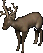 Great Hart      | 59.1  | 2 - 8  |  41 - 71  |   10   |
|     Giant Spider    | 59.1  | 2 - 14 | 75 - 100  |   6    |
|     Grizzly Bear    | 59.1  | 3 - 12 | 125 - 155 |   10   |
|      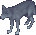 White Wolf      | 65.1  | 2 - 8  |  55 - 80  |   7    |
|            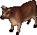 Bull            | 71.1  | 1 - 6  | 77 - 111  |   14   |
|         Hell cat        | 71.1  | 3 - 15 |  15 - 55  |   15   |
|     Frost Spider    | 74.7  | 6 - 16 |  46 - 60  |   28   |
|      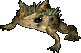 Giant Toad      | 77.1  | 5 - 17 |  46 - 60  |   24   |
|  Frenzied Ostard | 77.1  | 8 - 23 | 94 - 170  |   15   |
|     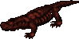 Lava Lizard     | 80.7  | 2 - 28 | 125 - 150 |   20   |
|        Dire Wolf       | 83.1  | 3 - 12 | 125 - 155 |   10   |
|             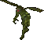 Imp             | 83.1  | 3 - 18 | 76 - 100  |   15   |
|       Hell Hound      | 85.5  | 6 - 20 | 96 - 120  |   11   |
|          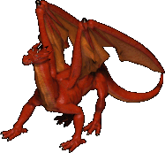 Dragon          | 93.9  | 4 - 24 | 780 - 820 |   30   |
|           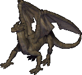 Drake           | 95.1  | 4 - 24 | 380 - 420 |   28   |
|       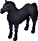 Nightmare       | 95.1  | 9 - 29 | 480 - 520 |   30   |
|      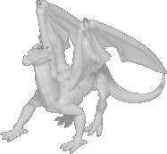 White Wyrm      | 96.3  | 9 - 33 | 795 - 825 |   30   |

<!--

Missing creatures

| Hue  | Body |      Name      |
|:----:|:----:|:--------------:|
|  0   | 254  |     Crane      |
| 2005 |  21  |  Giant Snake   |
|  0   |  92  | Silver Serpent |

-->

Even at GM, you still have a 5% chance of successfully taming a Dragon, White Wyrm or Drake. The message "You seem to anger the Beast" will reflect that.

## Bonding

All players start with one bond slot. Feed the animal you want to bond, after the message "You begin bonding with your pet." appears, stable the pet for 24 hours and then feed it again to bond it.

Bonded pets can recall with you.

### Bond slots

You can gain additional bond slots by completing the [Animal Bonding Quest](../../../custom-systems/animal-bonding-quest.md).

At 80 Animal Taming you will able to accept the quest at the Moonglow Zoo located at these coordinates (4540, 1367).

To complete the quest you will need to find and tame various rare animals, for more information you can go [here](../../../custom-systems/animal-bonding-quest.md).

### Pet retrieval

If you have lost your bonded pet, you can retrieve it at the Rangers Guild outside Skara Brae, at these coordinates (747, 2155).

Say `Find my pets` near the NPCs to use the service, the fee for retrieving a lost pet is 3.000 gold.

## Training

While training Taming you can also gain Animal Lore.

| Skill       | Tame                 | Location    |
|-------------|----------------------|-------------|
| 0 - 30      | Train from NPCs      |             |
| 35.1 - 53.1 | Walrus Polar Bear | Dagger Isle |
| 53.1 - 65.1 | Snow Leopard         | Dagger Isle |
| 65.1 - 71.1 | White Wolf           | Dagger Isle |
| 71.1 - 85.5 | Bull                 | Jhelom      |
| 85.5 - 100  | Hell Hound           | Hythloth    |

## Related skills

- [Animal Lore](animal-lore.md)
- [Veterinary](veterinary.md)
