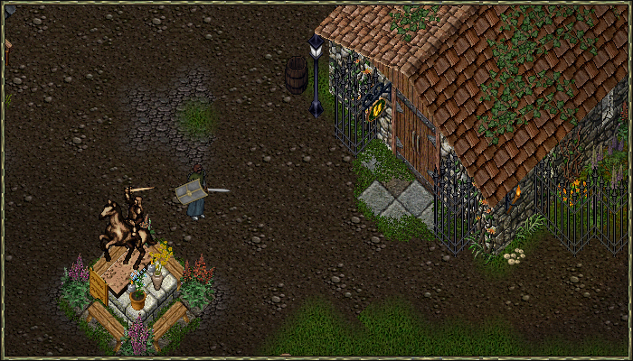
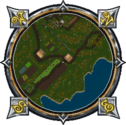
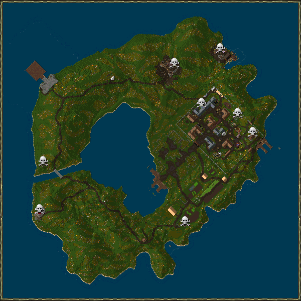
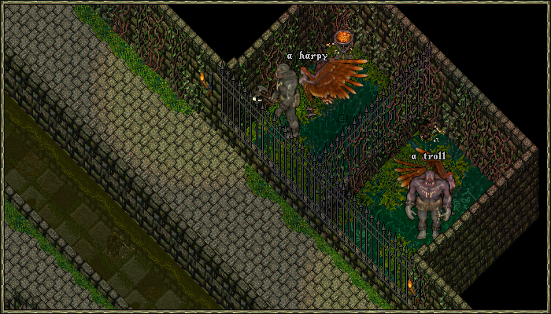

# New Player Guide

<!-- 
Welcome to New Dawn! This guide will walk you through everything you need to know as a new player.

## How to Start Playing New Dawn

### Step 1: Create Your Account

1. Go to [https://portal.uonewdawn.com/](https://portal.uonewdawn.com/) and log in with your Discord account to create a new New Dawn account
2. Review the [Getting Started guide](https://portal.uonewdawn.com/getting-started) on the portal
3. Review the server rules to learn what New Dawn is all about

### Step 2: Download The Launcher

1. Download & install the launcher from [https://portal.uonewdawn.com/getting-started](https://portal.uonewdawn.com/getting-started)
2. Let the launcher download game files (approximately 1.5GB)

!!! info "Download Time"
    The initial download is about 1.5GB and may take some time depending on your connection speed.

### Step 3: Authenticate Your Launcher

1. Click "Enter Britannia"
2. Log in with your Discord account if you haven't already
3. Click "Authenticate New Dawn Launcher"

### Step 4: Enter the Game

1. Click "Enter Britannia" again
2. Select one of your three accounts & create/select a character
3. Welcome to New Dawn! 
-->

## Before starting

This are some basics information that will help start your journey, you will discover even more later on.

- Horses can be tamed regardless of skill.
- All players start with one bond slot. Feed the pet you want to bond, after the message "You begin bonding with your pet." appears, stable the pet for 24 hours and then feed it again to bond it. Bonded pets can recall with you.
- The light filter is not available, making the experience really immersive. Don't worry, you will get used to it in no time, you can buy Nightsight potions or use the Night Sight spell, they will last a long time.
- Dungeons have a 50% skill boost gain, except for crafting skills.
- Recall charges inside a runebook don't require magery.
- You can't recall in or out of dungeons, instead, there are exit gates spread around.
- Instead of Dex penalty when wearing armor, you instead lose stamina when taking damage, based on the armor you're wearing.
- When you set a skill pointing down it will decrease at the same time as you gain on a skill pointing up, you don't have to wait to be at skill cap to lower a skill.

## Young program

You can enter the young program by typing `[young` in game. Each account can enter if below 120 hours of playtime.

Upon entering the program you will be teleported to Ocllo.

These are the benefits:

- No item loss on death; all gear stays in your backpack.
- Auto-teleport to a safe healer when you die.
- Monsters will not attack you unprovoked in Ocllo.
- Poison immunity & instant logout, no delay.
- Cannot be stolen from by other players.
- Access to the Ocllo Sewer for early training.

If you leave Occlo you will lose the young status, you can rejoin the program a set amount of times, so be careful.

You will also lose young if you commit a murder, reach 450 total skill, or raise a craft skill past 80.

## Occlo

Occlo is the main city, you can find basically every vendor type here.

It's the perfect city where to train or buy whatever you need.

Explore around and make some gold while training.

### Cotton farm

Just South outside of the city you will find a Cotton farm, you can use it only while in the Young program.

You should go here every chance you get to stock up on bandages.

### Occlo sewers

If you are Young, you receive a 50% skill gain bonus while inside this dungeon, but you cannot raise any skill above 80.

These are the entrances:

### Provo cage

This spot inside the Sewers is perfect for training Musicianship and Provocation up to 80.

Just Provo an Harpy to a Troll of the opposite cage.

## Starting template

The Provo Dexxer is one of the best templates to start with.

It doesn't rely on Magery for healing, so you don't need to worry about stocking up on reagents, and Magery is expensive to train anyway.

All you need is to gather cotton around the world to make bandages for free healing.

Provocation is extremely powerful on almost any template, and pairing it with a combat skill makes the build even more profitable.

- Musicianship
- Provocation
- Healing
- Anatomy
- Swordsmanship
- Tactics
- Parrying/Magery/Hiding

You also have some wiggle room for your 7th skill, which mainly serves as support depending on your play style.

Recall charges inside a runebook don't require magery. If you still want Magery to recall around please note:

- Casting from scrolls does not require reagents. If successful, the mana consumed will be the same as for normal spells, and the scroll will disappear.
- You need 50 Magery to never fail casting from recall scrolls.
- You need 70 Magery to never fail casting recall from spells.

### Starting skills

The skills you choose during character creation aren't very important, since you can train any skill up to around 50 using gold.

Consider making characters on your other accounts to funnel their starting gold to your main and fund early training.
  
### Starting stats

You should start every character with at least 12 Dexterity, otherwise you won't be able to go trough players and monsters.

For this template, depending on how often you want to use Magery, these are the recommended starting stats:

- Magery low usage: 47 strength, 12 dexterity, 11 intelligence
- Magery high usage: 40 Strength, 12 Dexterity, 28 Intelligence

??? Note "Click to expand: Skills that raise stats"

    This list has all the skills that give stat gains.

    Strength:

    - Camping
    - Fencing
    - Herding
    - Lumberjacking
    - Mace Fighting
    - Mining
    - Swordsmanship

    Dexterity:

    - Camping
    - Fencing
    - Musicianship
    - Snooping

    Intelligence:
    
    - Camping
    - Spirit Speak

## Summoner template

Once you have enough gold to train Magery, the Summoner is a very strong build.

You will be able to summon powerful Deamons and other creatures.

- Musicianship
- Provocation
- Magery
- Meditation
- Spirit Speak
- Animal Lore
- Resisting spells/Evaluating Intelligence/Hiding

Visit the [Spirit Speak](../game-mechanics/skills/magic/spirit-speak.md) page for more information.

## Training

For an in-depth explanation on how a skill works or how to train, browse the skill pages.

Remember, the closer you are to the skill cap the slower you will gain.

## Community

If you didn't already, hop on [discord](https://discord.gg/AStx3wYAPj).

There are always various player driven events and facilities to help new players train.
