# Hues

Browse all available hues on New Dawn. Use the search box to find specific hue IDs, or adjust the number of results per page.

!!! info
    This list *is not* a list of every hue available to players in the game. In fact, some are simply unusable and will hopefully be replaced in a future update. This is simply the full list hues in the game files, bad ones included.

<link rel="stylesheet" href="https://cdn.datatables.net/1.13.7/css/jquery.dataTables.min.css">

<table id="hues-table" class="display" style="width:100%">
<thead>
  <tr>
    <th>Hue ID</th>
    <th>Hue Sample</th>
    <th>Paperdoll Preview</th>
  </tr>
</thead>
<tbody>
<tr><td><a href="hue/?id=1">1</a></td><td></td><td></td></tr>
<tr><td><a href="hue/?id=2">2</a></td><td></td><td>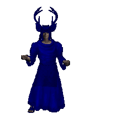</td></tr>
<tr><td><a href="hue/?id=3">3</a></td><td>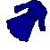</td><td>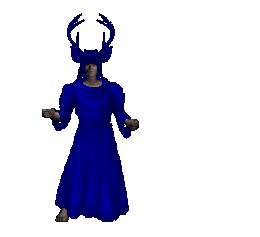</td></tr>
<tr><td><a href="hue/?id=4">4</a></td><td>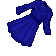</td><td>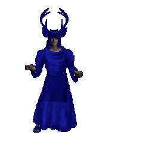</td></tr>
<tr><td><a href="hue/?id=5">5</a></td><td>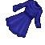</td><td>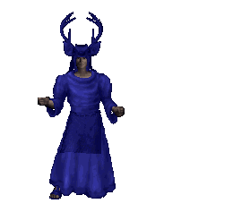</td></tr>
<tr><td><a href="hue/?id=6">6</a></td><td></td><td>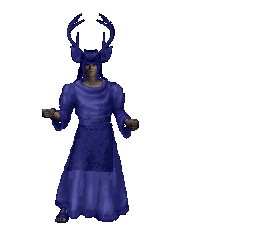</td></tr>
<tr><td><a href="hue/?id=7">7</a></td><td></td><td>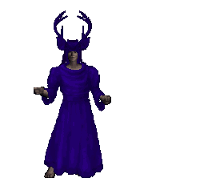</td></tr>
<tr><td><a href="hue/?id=8">8</a></td><td></td><td>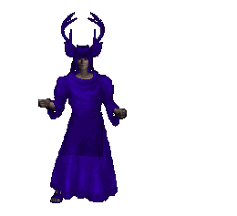</td></tr>
<tr><td><a href="hue/?id=9">9</a></td><td></td><td>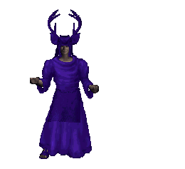</td></tr>
<tr><td><a href="hue/?id=10">10</a></td><td></td><td>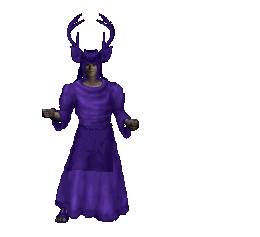</td></tr>
<tr><td><a href="hue/?id=11">11</a></td><td></td><td>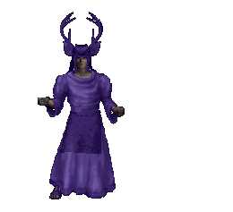</td></tr>
<tr><td><a href="hue/?id=12">12</a></td><td></td><td></td></tr>
<tr><td><a href="hue/?id=13">13</a></td><td></td><td>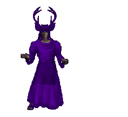</td></tr>
<tr><td><a href="hue/?id=14">14</a></td><td>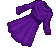</td><td>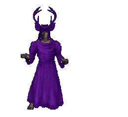</td></tr>
<tr><td><a href="hue/?id=15">15</a></td><td></td><td></td></tr>
<tr><td><a href="hue/?id=16">16</a></td><td></td><td></td></tr>
<tr><td><a href="hue/?id=17">17</a></td><td></td><td></td></tr>
<tr><td><a href="hue/?id=18">18</a></td><td></td><td></td></tr>
<tr><td><a href="hue/?id=19">19</a></td><td></td><td>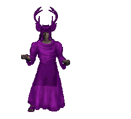</td></tr>
<tr><td><a href="hue/?id=20">20</a></td><td></td><td>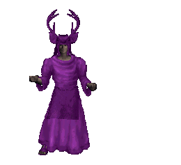</td></tr>
<tr><td><a href="hue/?id=21">21</a></td><td></td><td></td></tr>
<tr><td><a href="hue/?id=22">22</a></td><td>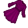</td><td>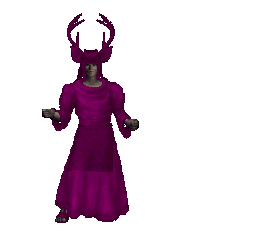</td></tr>
<tr><td><a href="hue/?id=23">23</a></td><td></td><td>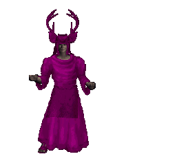</td></tr>
<tr><td><a href="hue/?id=24">24</a></td><td></td><td>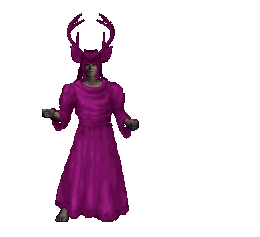</td></tr>
<tr><td><a href="hue/?id=25">25</a></td><td></td><td></td></tr>
<tr><td><a href="hue/?id=26">26</a></td><td></td><td>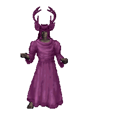</td></tr>
<tr><td><a href="hue/?id=27">27</a></td><td></td><td>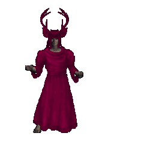</td></tr>
<tr><td><a href="hue/?id=28">28</a></td><td></td><td></td></tr>
<tr><td><a href="hue/?id=29">29</a></td><td></td><td></td></tr>
<tr><td><a href="hue/?id=30">30</a></td><td></td><td></td></tr>
<tr><td><a href="hue/?id=31">31</a></td><td></td><td></td></tr>
<tr><td><a href="hue/?id=32">32</a></td><td></td><td>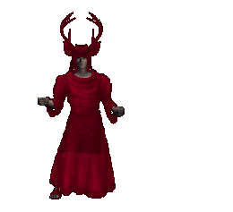</td></tr>
<tr><td><a href="hue/?id=33">33</a></td><td></td><td></td></tr>
<tr><td><a href="hue/?id=34">34</a></td><td></td><td></td></tr>
<tr><td><a href="hue/?id=35">35</a></td><td></td><td></td></tr>
<tr><td><a href="hue/?id=36">36</a></td><td></td><td></td></tr>
<tr><td><a href="hue/?id=37">37</a></td><td></td><td>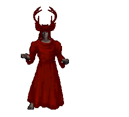</td></tr>
<tr><td><a href="hue/?id=38">38</a></td><td></td><td>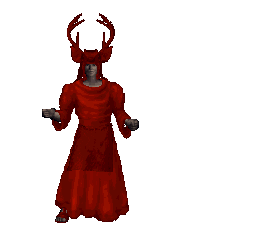</td></tr>
<tr><td><a href="hue/?id=39">39</a></td><td></td><td>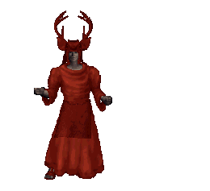</td></tr>
<tr><td><a href="hue/?id=40">40</a></td><td></td><td>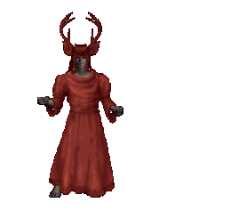</td></tr>
<tr><td><a href="hue/?id=41">41</a></td><td>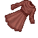</td><td>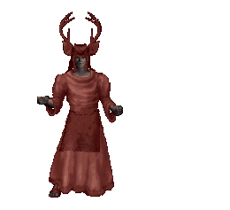</td></tr>
<tr><td><a href="hue/?id=42">42</a></td><td>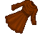</td><td>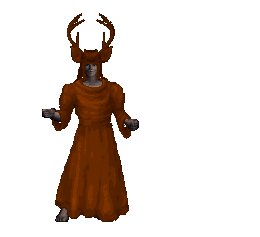</td></tr>
<tr><td><a href="hue/?id=43">43</a></td><td></td><td>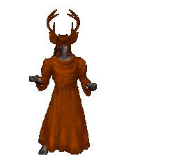</td></tr>
<tr><td><a href="hue/?id=44">44</a></td><td></td><td>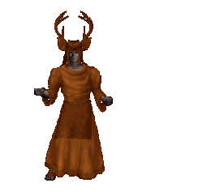</td></tr>
<tr><td><a href="hue/?id=45">45</a></td><td></td><td>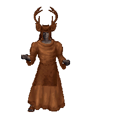</td></tr>
<tr><td><a href="hue/?id=46">46</a></td><td></td><td>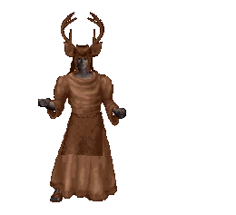</td></tr>
<tr><td><a href="hue/?id=47">47</a></td><td></td><td></td></tr>
<tr><td><a href="hue/?id=48">48</a></td><td></td><td>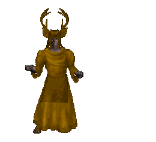</td></tr>
<tr><td><a href="hue/?id=49">49</a></td><td></td><td>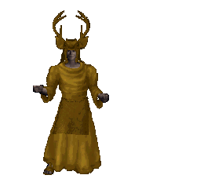</td></tr>
<tr><td><a href="hue/?id=50">50</a></td><td></td><td>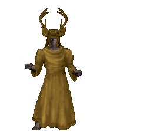</td></tr>
</tbody>
</table>

<!-- Lightbox Modal -->

  &times;
  
  

