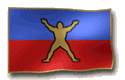

{ align=right }

# Anatomy

## Overview

Anatomy passively boosts the damage of your physical attacks.

When combined with Healing, it increases how much you heal with bandages.

When combined with Evaluating Intelligence, they function as a passive Wrestling further enhancing your combat effectiveness.

Starting items if you choose this skill in character creation: Robe, Bandages.

## Damage bonus

Every 10 points of Anatomy add a 2% increase to all physical damage, up to a maximum of 20% at GM.

## Training

Train from Healer NPCs to reach around 50.

Anatomy can be used on a 1 second cooldown, it doesn't have any difficulty checks.

You can train by using it on players, monsters, and animals until you reach 100.

## Related skills

- [Healing](healing.md)
- [Evaluating Intelligence](../magic/evaluating-intelligence.md)
- [Wrestling](wrestling.md)
- [Tactics](tactics.md)
