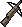

{ align=right }

# Bowcraft/Fletching

## Overview

Bowcraft/Fletching allows you to craft ranged weapons and ammunition, essential for archers.

Starting items if you choose this skill in character creation: Boards, Feathers, Shafts.

## Tools

In order to start crafting, you will need an Arrow Fletching tool, you can purchase one from bowyers vendors.

## Crafting list

These are all the ammunition and weapons you can craft.

=== "Materials"

    |                         Item                         |    Resources     | Skill |
    |:----------------------------------------------------:|:----------------:|:-----:|
    |  Kindling | 1 Boards or Logs |   0   |
    |     Shaft    | 1 Boards or Logs |   0   |

=== "Ammunition"

    |                          Item                          |          Resources           | Skill |
    |:------------------------------------------------------:|:----------------------------:|:-----:|
    |      Arrow     | 1 Arrow Shafts 1 Feathers |   0   |
    |  Crossbow Arrow | 1 Arrow Shafts 1 Feathers |   0   |
        
=== "Weapons"

    |                               Item                               |     Resources     | Skill |
    |:----------------------------------------------------------------:|:-----------------:|:-----:|
    |             Bow            | 7 Boards or Logs  |  30   |
    |        Crossbow       | 7 Boards or Logs  |  60   |
    |  Heavy Crossbow | 10 Boards or Logs |  80   |

## Repair deed

To craft a repair deed you will need a blank scroll, use your tool, click repair and target the scroll.

## Training

Consider Lumberjacking to fund the training.

| Skill    | Item            |
|----------|-----------------|
| 0 - 30   | Train from NPCs |
| 30 - 70  | Bows            |
| 70 - 90  | Crossbows       |
| 90 - 100 | Heavy Crossbow  |

## Related skills

- [Archery](../combat/archery.md)
- [Lumberjacking](../resource-gathering/lumberjacking.md)
