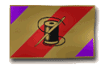
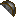
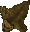
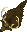
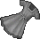
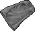
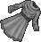

{ align=right }

# Tailoring

## Overview

Tailoring allows you to craft clothing and leather armors.

Starting items if you choose this skill in character creation: Sewing Kit, Bolt of Cloth.

## Tools

In order to start crafting, you will need a Sewing kit, you can purchase one from tailor vendors.

## Crafting list

These are all the clothes and armor you can craft.

=== "Hats"

    |                               Item                               | Resources | Skill |
    |:----------------------------------------------------------------:|:---------:|:-----:|
    |        Skullcap       |  2 Cloth  |  0.0  |
    |         Bandana        |  2 Cloth  |  0.0  |
    |      Floppy Hat     | 11 Cloth  |  6.2  |
    |             Cap            | 11 Cloth  |  6.2  |
    |   Wide-Brim Hat  | 12 Cloth  |  6.2  |
    |       Straw Hat      | 10 Cloth  |  6.2  |
    |  Tall Straw Hat | 12 Cloth  |  6.7  |
    |      Wizard Hat     | 15 Cloth  |  7.2  |
    |          Bonnet         | 11 Cloth  |  6.2  |
    |   Feathered Hat  | 12 Cloth  |  6.2  |
    |      Tricorne     | 12 Cloth  |  6.2  |
    |      Jester Hat     | 15 Cloth  |  7.2  |

=== "Bone Armor"

    |                              Item                              |             Resources             | Skill |
    |:--------------------------------------------------------------:|:---------------------------------:|:-----:|
    |      Bear Mask     | 6 Leather or Hides 1 Bear Head | 80.0  |
    |      Deer Mask     | 6 Leather or Hides 1 Deer Head | 80.0  |
    |    Bone Helmet   |   4 Leather or Hides 2 Bones   | 85.0  |
    |    Bone Gloves   |   6 Leather or Hides 2 Bones   | 89.0  |
    |      Bone Arms     |   8 Leather or Hides 4 Bones   | 92.0  |
    |  Bone Leggings |  10 Leather or Hides 6 Bones   | 95.0  |
    |     Bone Armor    |  12 Leather or Hides 10 Bones  | 96.0  |

=== "Shirts"

    |                            Item                            | Resources | Skill |
    |:----------------------------------------------------------:|:---------:|:-----:|
    |      Doublet     |  8 Cloth  |  0.0  |
    |        Shirt       |  8 Cloth  | 20.7  |
    |  Fancy Shirt |  8 Cloth  | 24.8  |
    |        Tunic       | 12 Cloth  |  0.0  |
    |      Surcoat     | 14 Cloth  |  8.2  |
    |  Plain Dress | 10 Cloth  | 33.1  |
    |  Fancy Dress | 12 Cloth  | 12.4  |
    |        Cloak       | 14 Cloth  | 41.4  |
    |         Robe        | 16 Cloth  | 53.9  |
    |  Jester Suit | 24 Cloth  |  8.2  |

=== "Pants"

    |                            Item                            | Resources | Skill |
    |:----------------------------------------------------------:|:---------:|:-----:|
    |  Short Pants |  6 Cloth  | 24.8  |
    |   Long Pants  |  8 Cloth  | 24.8  |
    |         Kilt        |  8 Cloth  | 20.7  |
    |        Skirt       | 10 Cloth  | 29.0  |

=== "Miscellaneous"

    |                           Item                           | Resources | Skill |
    |:--------------------------------------------------------:|:---------:|:-----:|
    |   Body Sash  |  4 Cloth  |  4.1  |
    |  Half Apron |  6 Cloth  | 20.7  |
    |  Full Apron | 10 Cloth  | 29.0  |
    |   Oil Cloth  |  1 Cloth  | 74.6  |

=== "Footwear"

    |                            Item                            |      Resources      | Skill |
    |:----------------------------------------------------------:|:-------------------:|:-----:|
    |      Sandals     | 4 Leather or Hides  | 12.4  |
    |        Shoes       | 6 Leather or Hides  | 16.5  |
    |        Boots       | 8 Leather or Hides  | 33.1  |
    |  Thigh Boots | 10 Leather or Hides | 41.4  |

=== "Leather Armor"

    |                                 Item                                 |      Resources      | Skill |
    |:--------------------------------------------------------------------:|:-------------------:|:-----:|
    |    Leather Gorget   | 4 Leather or Hides  | 53.9  |
    |       Leather Cap      | 2 Leather or Hides  |  6.8  |
    |    Leather Gloves   | 3 Leather or Hides  | 51.8  |
    |   Leather Sleeves  | 4 Leather or Hides  | 53.9  |
    |  Leather Leggings | 10 Leather or Hides | 66.3  |
    |     Leather Tunic    | 12 Leather or Hides | 70.5  |

=== "Studded Armor"

    |                                 Item                                 |      Resources      | Skill |
    |:--------------------------------------------------------------------:|:-------------------:|:-----:|
    |    Studded Gorget   | 6 Leather or Hides  | 78.8  |
    |    Studded Gloves   | 8 Leather or Hides  | 82.9  |
    |   Studded Sleeves  | 10 Leather or Hides | 87.1  |
    |  Studded Leggings | 12 Leather or Hides | 91.2  |
    |     Studded Tunic    | 14 Leather or Hides | 95.4  |

=== "Female Armor"

    |                                     Item                                     |      Resources      | Skill |
    |:----------------------------------------------------------------------------:|:-------------------:|:-----:|
    |        Leather Shorts       | 8 Leather or Hides  | 62.2  |
    |         Leather Skirt        | 6 Leather or Hides  | 58.0  |
    |       Leather Bustier      | 6 Leather or Hides  | 58.0  |
    |       Studded Bustier      | 8 Leather or Hides  | 82.9  |
    |  Female Leather Armor | 8 Leather or Hides  | 62.2  |
    |     Female Studded Armor     | 10 Leather or Hides | 87.1  |

## Repair deed

To craft a repair deed you will need a blank scroll, use your tool, click repair and target the scroll.

## Making cloth

You can gather Cotton and Flax from plants by double clicking them, you can also gather Wool by using a dagger on a sheep.

After gathering the resources, you can use them on a Spinning Wheel to get Spools of Thread and Balls of Yarn to then use on a Loom and get Bolts of Cloth.

Lastly you can use scissors on the Bolts to get Cloth.

=== "Gathering"

    |                             From                             |                           Get                            |
    |:------------------------------------------------------------:|:--------------------------------------------------------:|
    |  Cotton Plant |  Bale of Cotton |
    |    Flax Plant   |    Flax Bundle    |
    |        Sheep       |    Pile of Wool   |

=== "Spinning Wheel"

    |                           Use                            |                                Get                                 |
    |:--------------------------------------------------------:|:------------------------------------------------------------------:|
    |  Bale of Cotton |  6 Spools of Thread |
    |    Flax Bundle    |  6 Spools of Thread |
    |    Pile of Wool   |     3 Balls of Yarn    |

=== "Upright Loom"

    |                                Use                                 |                              Get                              |
    |:------------------------------------------------------------------:|:-------------------------------------------------------------:|
    |  5 Spools of Thread |  1 Bolt of Cloth |
    |     5 Balls of Yarn    |  1 Bolt of Cloth |

## Leather Hides

This list shows which animal and monster drop specific leather.

=== "Normal"

    |                               Animal                               | Yield |
    |:------------------------------------------------------------------:|:-----:|
    |             Cat            |   1   |
    |         Gorilla        |   1   |
    |    Snow Leopard   |   1   |
    |      Polar Bear     |   3   |
    |          Rabbit         |   4   |
    |       Grey Wolf      |   6   |
    |      White Wolf     |   6   |
    |            Goat           |   8   |
    |            Hind           |   8   |
    |          Cougar         |  10   |
    |           Horse          |  10   |
    |      Pack Horse     |  10   |
    |         Panther         |  10   |
    |      Black Bear     |  12   |
    |      Brown Bear     |  12   |
    |             Cow            |  12   |
    |  Llama Rideable Llama |  12   |
    |       Mountain Goat       |  12   |
    |          Walrus         |  12   |
    |            Bull           |  15   |
    |      Great Hart     |  15   |
    |     Grizzly Bear    |  16   |

=== "Spined"

    |                                 Monster                                  | Yield |
    |:------------------------------------------------------------------------:|:-----:|
    |          Dire Wolf         |   6   |
    |                Imp               |   6   |
    |             Ratman            |   8   |
    |            Hellcat           |  10   |
    |          Alligator         |  12   |
    |         Giant Toad        |  12   |
    |          Lizardman         |  12   |
    |        Lava Lizard       |  14   |
    |  Giant Ice Serpent |  15   |
    |      Giant Serpent     |  15   |
    |       Lava Serpent      |  15   |

=== "Horned"

    |                                     Monster                                      | Yield |
    |:--------------------------------------------------------------------------------:|:-----:|
    |  Sea Serpent Deep Sea Serpent |  10   |
    |                  Drake                 |  20   |
    |                 Wyvern                |  20   |

=== "Barbed"

    |                            Monster                             | Yield |
    |:--------------------------------------------------------------:|:-----:|
    |     Nightmare    |  10   |
    |  Ancient Wyrm |  20   |
    |        Dragon       |  20   |
    |   Shadow Wyrm  |  20   |
    |    White Wyrm   |  20   |

## Bulk order deeds

A minimum skill of 70.1 (real) is required to get a BOD.

You must have 85.1 (real) or higher for a chance to get a large BOD.

The BOD 6-hour time limit applies to your whole account.

### Cloth BOD Rewards

| Points |                Rewards                |
|:------:|:-------------------------------------:|
|   0    |         Cloth (Tier 5) (100%)         |
|   50   |         Cloth (Tier 4) (100%)         |
|  100   |         Cloth (Tier 3) (100%)         |
|  150   | Cloth (Tier 2) (90%) Sandals (10%) |
|  200   | Cloth (Tier 1) (80%) Sandals (20%) |

#### BOD Cloth Hues by Tier

| Cloth Tier |     Available Hues     |
|:----------:|:----------------------:|
|   Tier 5   | 1155, 1758, 2013, 2004 |
|   Tier 4   | 1104, 1160, 2016, 1126 |
|   Tier 3   | 2133, 2146, 1140, 1173 |
|   Tier 2   | 2157, 1163, 1175, 2124 |
|   Tier 1   | 1157, 1154, 2118, 1165 |

#### BOD Sandal Hues

Available sandal hues: 1243, 1321, 1207, 1352, 1534, 1416, 1505, 1621

### BOD Rewards

| Points |                           Rewards                            |
|:------:|:------------------------------------------------------------:|
|  300   |             Stretched Hide (random of 4) (100%)              |
|  350   |                 Ore Mask Dye (Tier 3) (100%)                 |
|  400   |                Tapestry (random of 4) (100%)                 |
|  450   |                       Bear Rug (100%)                        |
|  500   |             Tailoring Shelf (random of 4) (100%)             |
|  550   | Clothing Bless Deed (CBD) (80%) Sandals (mask dyes) (20%) |
|  600   |    Ore Mask Dye (Tier 2) (80%) Mask Dye (type 2) (20%)    |
|  650   |               Tailoring Deco (see note) (100%)               |
|  700   |    Ore Mask Dye (Tier 1) (80%) Mask Dye (type 1) (20%)    |
|  750   |              Master Tailoring Apron (+5) (100%)              |
|  800   |           Grandmaster Tailoring Apron (+10) (100%)           |

#### Tailoring Deco

You have a 50% chance to roll 1 of 4 hanging clothes. The other 50% will roll 1 of 2 tailoring kids.

#### Ore Mask Dyes

| Tier |  Ore Type   | Hue ID |
|:----:|:-----------:|-------:|
|  1   | Shadow Iron |   2406 |
|  1   |    Gold     |   2413 |
|  1   |  Valorite   |   2219 |
|  2   |   Agapite   |   2425 |
|  2   |   Verite    |   2207 |
|  3   | Dull Copper |   2419 |
|  3   |   Copper    |   2213 |
|  3   |   Bronze    |   2418 |

#### Regular Mask Dyes

Available regular mask dye hues: 1109, 1157, 1321, 1243, 1416, 1207, 1505

## Training

Consider cutting what you craft to recoup some of the materials.

| Skill       | Item            |
|-------------|-----------------|
| 0 - 30      | Train from NPCs |
| 30.0 - 49.8 | Fancy Shirt     |
| 49.8 - 52.0 | Skirt           |
| 52.0 - 55.0 | Fancy Dress     |
| 55.0 - 74.6 | Robe            |
| 74.6 - 99.5 | Oil Cloth       |
| 99.5 - 100  | Studded Gorget  |
