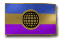

{ align=right }

# Cartography

## Overview

Cartography allows you to draw maps of various regions and decode treasure maps. Essential for treasure hunters.

Cartography is also essential for Archaeology content, needed to decipher map fragments.

## Draw maps

Use the skill on a blank map to choose its scale. Higher skill allows larger scales. If the attempt succeeds, the map is filled-in based on your current location.

## Decoding treasure maps

Double click the map you want to decode, if you can decode it, you will receive a map with a pin marking the treasure location within 30 tiles.

## Deciphering clues

70+ Cartography is required for deciphering map fragments, double-click it in your backpack to attempt to interpret it, failure doesn't consume the clue.

It also gives you +10% artifact chance at 100.

For more information about Archaeology go [here](../../custom-systems/archaeology.md).

## Training

Train from Mapmaker NPCs to reach around 50.

| Skill      | Draw                               |
|------------|------------------------------------|
| 20 - 52    | Local Maps                         |
| 52 - 65    | City Maps                          |
| 65 - 67    | Sea Charts                         |
| 67 - 99.5  | World Maps                         |
| 99.5 - 100 | Level 2 - 4 Tattered Treasure Maps |
